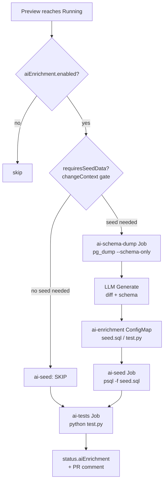

# AI Enrichment

> After a preview is Running, the operator asks an LLM to generate PR-relevant seed data and targeted tests, runs them as Jobs, and posts a summary on the pull request.

## Introduction

AI Enrichment is an optional add-on that turns a freshly deployed preview into a *populated, exercised* environment. Using the PR diff and the live database schema, an OpenAI-compatible model produces a `seed.sql` file and a Python `test.py` script. The operator executes both as Kubernetes Jobs and reports the outcome back in the GitHub PR comment, so reviewers see realistic data and endpoint coverage tied to the change under review.

## What it's for

A blank preview database is rarely useful: reviewers cannot click through a feature with no rows, and writing throwaway seed data and smoke tests for every PR is tedious. AI Enrichment removes that manual step. It seeds tables that the PR actually touches and tests the endpoints the PR actually added or modified, giving a ready-to-use environment with PR-relevant data plus tests — without anyone hand-writing fixtures.

## What it does

1. Reads the AI provider **API key** from the Secret referenced by `spec.aiEnrichment.apiSecretRef` (default namespace `preview-operator-system`, default key `api-key`).
2. Resolves the **PR diff** — preferring `spec.changeContext.diffPatch` when present, otherwise fetching it from GitHub (a fetch failure is non-fatal).
3. Dumps the **DB schema** via a `pg_dump --schema-only` Job (`ai-schema-dump`), waiting for any migration to succeed first.
4. Calls the **LLM** with the diff + schema; the response is JSON with `seed_sql` and `test_script`.
5. Stores the result in the **`ai-enrichment` ConfigMap** (keys `seed.sql` and `test.py`).
6. Runs the **`ai-seed` Job** (`psql -f /data/seed.sql`) to populate the database.
7. Runs the **`ai-tests` Job** (`python /data/test.py`, with `APP_URL` injected) and scrapes `PASS`/`FAIL` lines.
8. Writes status to `status.aiEnrichment` and posts the **AI Enrichment section** on the PR comment.

## How it works



The reconciler runs only when `spec.aiEnrichment.enabled` is true. It first ensures the `ai-enrichment` ConfigMap exists, generating content when missing: it waits for the schema dump to be ready, then calls the AI client and stores `seed.sql`/`test.py`. The seed and tests Jobs then run independently; each reports `Succeeded`, `Failed`, or `Skipped`. Once both are terminal the phase becomes `Succeeded` (or `Failed` if either failed), a summary is built, and the GitHub AI comment is synced. The seed step is governed by the `requiresSeedData` gate: when there is no explicit `seed` config and `changeContext.detectedImpacts.requiresSeedData` is false, the AI seed is skipped; an explicit `seed.enabled` always wins over the heuristic.

## Relationships with other components

- [Change Context](./change-context.md) — supplies the diff (`diffPatch`) and the `requiresSeedData` gate that decides whether seed data is generated.
- [Ephemeral PostgreSQL](./ephemeral-postgres.md) — provides the schema (via `pg_dump`) and the database the `ai-seed` Job writes into; the schema dump waits for migration to complete.
- [GitHub Integration](./github-integration.md) — renders the AI Enrichment section in the PR comment and supplies the diff/token fallback.
- [Test Suites](./test-suites.md) — the standard smoke/regression/e2e suite; an AI-only rerun skips it for that cycle.
- [Copilot Extension](./copilot-extension.md) — exposes `@preview enrich` / `@preview retest-ai` to trigger a rerun and surfaces AI status in `@preview status`.
- [Customizing AI Prompts](./ai-prompts.md) — steer the seed/test generation per-PR (`set-prompt`) or globally (Helm), plus the `temperature` knob.

## Configuration

`spec.aiEnrichment.*` fields:

| Field | Type | Default | Description |
|---|---|---|---|
| `enabled` | bool | `false` | Master switch; enrichment runs only when true. |
| `apiSecretRef` | SecretKeyRef | — (required when enabled) | Secret holding the API key. Namespace defaults to `preview-operator-system`, key to `api-key`. |
| `githubTokenSecretRef` | ref | falls back to `spec.github.tokenSecretRef` | Token used to fetch the PR diff. |
| `model` | string | `gpt-4o-mini` | OpenAI-compatible model name. |
| `temperature` | string | `"0.2"` | Sampling temperature in `[0, 2]` as a decimal string; invalid values fall back to `0.2`. |
| `seed.enabled` | bool | `true` | Run the AI seed Job. When `seed` is omitted, the `requiresSeedData` gate decides. |
| `seed.image` | string | `postgres:15-alpine` | Image for the `ai-seed` Job. |
| `tests.enabled` | bool | `true` | Run the AI tests Job. When `tests` is omitted, it defaults to enabled. |
| `tests.image` | string | `python:3.12-slim` | Image for the `ai-tests` Job. |
| `rerunRequested` | bool | `false` | Triggers an AI-only rerun; the operator clears it once the rerun completes. |

> Note: `seed` and `tests` are `AIEnrichmentTaskSpec` objects whose `enabled` field defaults to **`true`** (kubebuilder default). Omitting the block entirely also means enabled — except `seed`, which additionally consults the `requiresSeedData` gate when no block is set. Set `enabled: false` explicitly to disable a task while keeping enrichment on.

**Operator environment variable** — the AI endpoint is configured cluster-wide via `AI_API_URL` (read in `cmd/main.go`; defaults to `https://api.openai.com/v1`):

| Provider | `AI_API_URL` example |
|---|---|
| OpenAI | `https://api.openai.com/v1` |
| GitHub Models | `https://models.inference.ai.azure.com` |
| Azure OpenAI | `https://<resource>.openai.azure.com/openai/deployments/<deployment>` |

The client appends `/chat/completions`; for Azure hosts it adds `?api-version=2024-10-21` and uses the `api-key` header instead of `Authorization: Bearer`. Requests retry on 429/5xx with exponential backoff.

Minimal `Preview` example:

```yaml
apiVersion: platform.company.io/v1alpha1
kind: Preview
metadata:
  name: pr-42
spec:
  branch: feature/orders
  prNumber: 42
  image: ghcr.io/acme/app:pr-42
  database:
    enabled: true
  aiEnrichment:
    enabled: true
    model: gpt-4o-mini
    temperature: "0.2"
    apiSecretRef:
      name: ai-api-key   # namespace preview-operator-system, key api-key
```

The api-key Secret (in `preview-operator-system`):

```bash
kubectl -n preview-operator-system create secret generic ai-api-key \
  --from-literal=api-key=sk-...
```

**Rerun.** `@preview enrich` and `@preview retest-ai` both set `spec.aiEnrichment.rerunRequested = true` (`cmdEnrich` simply calls `cmdRetestAI`). This replays migration/seed when a database is enabled, regenerates the AI artifacts, skips the standard test suite for that cycle, and re-runs `ai-seed` then `ai-tests`. The PR comment uses `SUCCESS` / `FAIL` / `RUN` / `SKIP` labels for the seed and tests rows (`statusIcon` maps `Succeeded`/`Failed`/`Running`+`Generating`/everything-else respectively).

## Reference

- Pipeline & rerun: [`internal/controller/ai_enrichment.go`](https://github.com/ihsenalaya/preview-operator/blob/main/internal/controller/ai_enrichment.go)
- OpenAI-compatible client: [`internal/ai/client.go`](https://github.com/ihsenalaya/preview-operator/blob/main/internal/ai/client.go)
- API types (`AIEnrichmentSpec`, `AIEnrichmentTaskSpec`, `AIEnrichmentStatus`, `SecretKeyRef`): [`api/v1alpha1/preview_types.go`](https://github.com/ihsenalaya/preview-operator/blob/main/api/v1alpha1/preview_types.go)
- PR comment & `statusIcon`: [`internal/controller/github.go`](https://github.com/ihsenalaya/preview-operator/blob/main/internal/controller/github.go)
- `AI_API_URL` wiring: [`cmd/main.go`](https://github.com/ihsenalaya/preview-operator/blob/main/cmd/main.go)
- Extension commands (`cmdEnrich`, `cmdRetestAI`): [`internal/extension/commands.go`](https://github.com/ihsenalaya/preview-operator/blob/main/internal/extension/commands.go)
- Design notes: [AI Enrichment Plan](https://github.com/ihsenalaya/preview-operator/blob/main/docs/ai-enrichment-plan.md)
