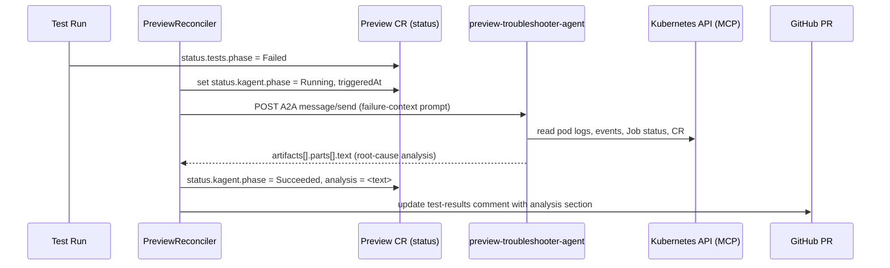

# AI Failure Analysis (kagent)

> When a preview's test suite fails, an external kagent AI agent performs a root-cause analysis that is surfaced in `status.kagent` and embedded into the GitHub PR comment.

## Introduction

A red CI check tells you *that* something broke; it rarely tells you *why*. This feature closes that gap by handing every failed preview to a kagent troubleshooter agent that inspects live cluster state and writes a human-readable diagnosis. The analysis flows back through the `Preview` CR status and into the same PR comment thread that carries the test results. It is opt-in via `spec.kagent.enabled` and requires **kagent 0.9.2**.

## What it's for

The default failure signal from a preview is a bare phase transition — `tests.phase = Failed`, a `Job` exit code, a crash-looping pod. Reviewers then dig through `kubectl logs`, events, and readiness probes by hand. This feature replaces "the pod crashed" with an actual root cause: it correlates failed test output, pod logs, Kubernetes events, and the test-strategist's suite-selection rationale into a single explanation plus a suggested fix, posted where the reviewer already is.

## What it does

- Triggers automatically once per test run when `status.tests.phase` becomes `Failed` (with a 5-minute cooldown and idempotency guards so it fires at most once per failure).
- Drives the `preview-troubleshooter-agent` (configurable via `spec.kagent.agentName`) over the A2A (Agent-to-Agent) JSON-RPC 2.0 protocol.
- Gives the agent rich context: the preview name, PR number, branch, namespace, GitHub repo, the test-strategist's `TestPlan` rationale/confidence/skips, and per-suite results (up to 10 output lines per suite).
- Lets the agent read cluster state read-only (pod logs, events, `Job` status, the `Preview` CR) via the Kubernetes MCP server (`kagent-tool-server`) — no write access, no secrets.
- Lets the agent read **distributed traces** via a second MCP server (`jaeger-mcp-server`: `jaeger_get_services` / `jaeger_get_traces` / `jaeger_get_trace`) so it can find failing requests in Jaeger — see [Observability](./observability.md) and [MCP Servers](./mcp-servers.md).
- Records progress in `status.kagent` (`phase`, `triggeredAt`, `analysis`, `commentId`).
- Embeds the resulting analysis into the existing test-results PR comment rather than opening a separate thread.

## How it works



When `tests.phase` flips to `Failed`, the reconciler sets `status.kagent.phase = Running`, stamps `triggeredAt`, and builds a failure-context prompt (`buildAnalysisPrompt`) from the CR status and the active `TestPlan`. It then calls the agent **directly and synchronously**: `callKagentAgent` POSTs the A2A JSON-RPC request over `http.DefaultClient` (with a bounded timeout context) to the agent's URL and waits for the response. The agent reads live cluster state through its own Kubernetes MCP server and returns the analysis text, which is written to `status.kagent.analysis` and folded into the test-results PR comment.

> **Note — two different trigger styles in this operator.** The kagent failure-analysis and diff-analysis paths make a direct in-controller A2A HTTP call (this guide). The separate [AI Test Strategist](./ai-test-strategist.md) uses the CRD-bus pattern instead: the controller creates a stub `TestPlan` plus an ephemeral `curlimages/curl` Job that pokes the agent, so that path holds no HTTP client. Don't conflate the two.

## Relationships with other components

- [Failure Provenance](./failure-provenance.md) — the durable `FailureReport` CRD (cluster-scoped, survives namespace teardown). kagent analysis is the *ephemeral, narrative* layer surfaced live on the PR; the `FailureReport` is the *durable, structured* record that outlives the preview. They are complementary: kagent explains a single failure in the moment, the FailureReport persists evidence for later querying and scoring.
- Smart Diagnostics within [Failure Provenance](./failure-provenance.md) — `fp-diagnose` / `fp-score` operate over persisted reports, where kagent operates over live cluster state.
- [Lifecycle & Provisioning](./lifecycle.md) — defines the phase machine; kagent is triggered off the `Failed` test phase within that lifecycle.
- [Security](./security.md) — the troubleshooter agent inspects the cluster with read-only RBAC and has no secret access; the API key/credentials for reaching the agent stay with the controller.
- [GitHub Integration](./github-integration.md) — the analysis is delivered by updating the existing test-results PR comment.
- [MCP Servers & Agent Tools](./mcp-servers.md) — the read-only tools (`k8s_get_pod_logs`, `k8s_get_events`, …) this agent uses; [Customizing AI Prompts](./ai-prompts.md) — where its `systemMessage` lives.

## Configuration

`spec.kagent.*` controls the integration. The agents must run on **kagent 0.9.2** (0.9.4 regressed A2A session handling) and live in the `kagent-system` namespace by default.

| Field | Type | Default | Description |
|---|---|---|---|
| `enabled` | bool | `false` | Triggers the troubleshooter when the test suite fails. |
| `namespace` | string | `kagent-system` | Namespace where the kagent agents run. |
| `agentName` | string | `preview-troubleshooter-agent` | Agent CR triggered on test failure — the focus of this guide. |
| `diffAnalyzerAgentName` | string | `preview-diff-analyzer` | Agent triggered when the preview first reaches Running (diff analysis). |
| `testStrategistAgentName` | string | `test-strategist-agent` | Agent triggered when a Pending `TestPlan` is created (`testStrategy.mode: Auto`). |

`status.kagent` exposes the result: `phase` (`Running` / `Succeeded` / `Failed`), `triggeredAt`, `analysis` (raw agent text), and `commentId`.

Minimal example:

```yaml
apiVersion: platform.company.io/v1alpha1
kind: Preview
metadata:
  name: pr-42
spec:
  kagent:
    enabled: true
    # namespace and agentName default to kagent-system / preview-troubleshooter-agent
```

## Reference

- Controller logic: [`internal/controller/kagent.go`](https://github.com/ihsenalaya/preview-operator/blob/main/internal/controller/kagent.go) — `triggerKagentAnalysis`, `callKagentAgent`, `buildAnalysisPrompt`, `setKagentPhase`.
- API types: [`api/v1alpha1/preview_types.go`](https://github.com/ihsenalaya/preview-operator/blob/main/api/v1alpha1/preview_types.go) — `KagentIntegrationSpec`, `KagentStatus`.
- Troubleshooting: [../troubleshooting-kagent.md](https://github.com/ihsenalaya/preview-operator/blob/main/docs/troubleshooting-kagent.md) — common kagent issues (agent URL, A2A session handling, timeouts). Note §5 there describes the *test-strategist* trigger Job, which is a different path from this direct failure-analysis call.
- README: [`../../README.md`](https://github.com/ihsenalaya/preview-operator/blob/main/README.md) — kagent install (Installation → "Install kagent") and the "Requires kagent 0.9.2" release note.
