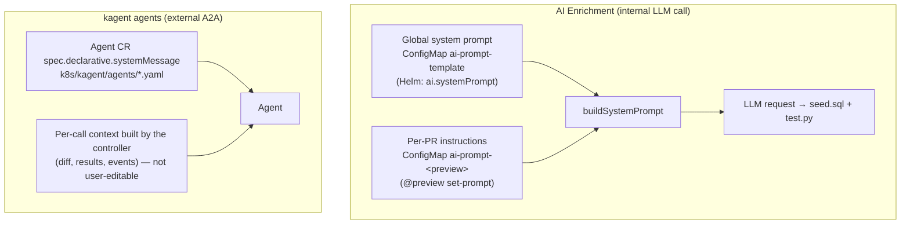

# Customizing AI Prompts

> Where every AI prompt in the operator lives, and how to change it — per‑PR, cluster‑wide, or per‑agent.

## Introduction
The operator uses LLMs in two places: **AI Enrichment** (generating seed data and
tests) and the **kagent agents** (test selection, failure analysis, diff analysis).
Each has its own prompt and its own way to customize it. This guide maps all of
them so you know exactly what to edit and what scope it affects.

## What it's for
Default prompts are general-purpose. Teams routinely need to steer them — "only
generate JSON-API tests", "seed at least 20 rows", "explain failures in French".
This guide shows the lightweight runtime knobs (no redeploy) and the deeper,
vetted-prompt path (edit + redeploy) so you pick the right lever.

## What it does
Three layers, from easiest to deepest:

- **Per‑PR enrichment instructions** — append free‑text guidance for one preview's seed/test generation, at runtime, via a Copilot command.
- **Global enrichment system prompt** — replace the base seed/test system prompt for *all* previews, at install time, via a Helm value.
- **kagent agent system prompts** — edit each agent's `systemMessage` in its Agent CR and redeploy.

## How it works



For enrichment, the controller reads the global system prompt and the per‑PR
instructions and merges them (`buildSystemPrompt`): if no global prompt is set it
falls back to a built‑in default, then appends your per‑PR text under an
`Additional instructions:` heading. For kagent, the durable instructions live in
each Agent CR's `systemMessage`; the controller only supplies per‑call *context*
(the diff, the test results), which is assembled in code and is not a customization
point without changing the source.

## Layer 1 — Per‑PR enrichment instructions (runtime, easiest)
Append guidance for a single preview's seed/test generation. Stored as ConfigMap
`ai-prompt-<preview-name>` (key `instructions`) in `preview-operator-system`.

```text
@preview set-prompt pr-42 Only generate tests for JSON API endpoints; ignore HTML pages.
@preview show-prompt pr-42
```

Equivalent without Copilot:

```bash
kubectl create configmap ai-prompt-pr-42 -n preview-operator-system \
  --from-literal=instructions='Only generate tests for JSON API endpoints; ignore HTML pages.'
# inspect:
kubectl get cm ai-prompt-pr-42 -n preview-operator-system -o jsonpath='{.data.instructions}'
```

Apply it by regenerating: `@preview retest-ai pr-42` (sets
`spec.aiEnrichment.rerunRequested=true`). The instructions persist across reruns
until you delete the ConfigMap. **Scope: that one PR's enrichment only — it does not
touch the kagent agents.**

## Layer 2 — Global enrichment system prompt (install time)
Replace the base system prompt used for *all* enrichment. It is stored in ConfigMap
`ai-prompt-template` (key `ai-system-prompt.txt`), seeded from
[`charts/preview-operator/files/ai-system-prompt.txt`](https://github.com/ihsenalaya/preview-operator/blob/main/charts/preview-operator/files/ai-system-prompt.txt)
and overridable via the `ai.systemPrompt` Helm value:

```bash
helm upgrade preview-operator ./charts/preview-operator \
  --namespace preview-operator-system \
  --set-file ai.systemPrompt=./my-system-prompt.txt --reuse-values
```

If `ai.systemPrompt` is empty (the default), the operator uses the built‑in
`defaultSystemPrompt` compiled into the binary. Per‑PR instructions (Layer 1) are
still appended on top of whatever global prompt is active.

## Layer 3 — kagent agent system prompts (edit + redeploy)
Each kagent agent's instructions live in its Agent CR under
`spec.declarative.systemMessage`. They are deliberately source‑controlled, not
runtime‑editable, so prompts stay vetted.

| Agent | File (in this repo) | Triggered by |
|-------|---------------------|--------------|
| test‑strategist | [`k8s/kagent/agents/test-strategist-agent.yaml`](https://github.com/ihsenalaya/preview-operator/blob/main/k8s/kagent/agents/test-strategist-agent.yaml) | a Pending `TestPlan` |
| failure‑analyst (troubleshooter) | [`k8s/kagent/agents/failure-analyst-agent.yaml`](https://github.com/ihsenalaya/preview-operator/blob/main/k8s/kagent/agents/failure-analyst-agent.yaml) | a failed test suite |
| diff‑analyzer | *not in this repo* (deployed by the kagent platform) | preview reaches `Running` |

To change one:

```bash
# edit spec.declarative.systemMessage in the Agent CR, then:
kubectl apply -f k8s/kagent/agents/failure-analyst-agent.yaml
```

The new prompt applies to subsequent agent runs. The reusable prompt text for the
test‑strategist is also kept at
[`k8s/kagent/agents/prompts/test-strategist.md`](https://github.com/ihsenalaya/preview-operator/blob/main/k8s/kagent/agents/prompts/test-strategist.md).

> **Per‑call context is not a prompt knob.** What the diff/results look like for a
> given run is built in Go (`buildAnalysisPrompt`, the test‑strategist payload).
> Change *behavior* via the agent's `systemMessage`, not by trying to edit that context.

## Relationships with other components
- [AI Enrichment](./ai-enrichment.md) — what Layers 1–2 steer; also home of `temperature`.
- [AI Test Strategist](./ai-test-strategist.md) and [AI Failure Analysis](./ai-failure-analysis.md) — the agents whose prompts Layer 3 edits.
- [MCP Servers & Agent Tools](./mcp-servers.md) — what those agents are *allowed* to do, alongside their prompts.
- [Copilot Extension](./copilot-extension.md) — the `set-prompt` / `show-prompt` / `retest-ai` commands.

## Configuration
| Knob | Scope | Where |
|------|-------|-------|
| `@preview set-prompt` / `show-prompt` | one PR, enrichment | ConfigMap `ai-prompt-<preview>` (`instructions`) in `preview-operator-system` |
| Helm `ai.systemPrompt` (`--set-file`) | all previews, enrichment | ConfigMap `ai-prompt-template` (`ai-system-prompt.txt`) |
| `spec.aiEnrichment.temperature` | one PR, sampling | default `"0.2"`, range `[0,2]` |
| Agent CR `spec.declarative.systemMessage` | all runs of that agent | `k8s/kagent/agents/*.yaml` (edit + apply) |

## Reference
- Enrichment prompt fetch/merge: [`../../internal/controller/ai_enrichment.go`](https://github.com/ihsenalaya/preview-operator/blob/main/internal/controller/ai_enrichment.go) (`fetchSystemPrompt`, `fetchExtraInstructions`) and [`../../internal/ai/client.go`](https://github.com/ihsenalaya/preview-operator/blob/main/internal/ai/client.go) (`buildSystemPrompt`, `defaultSystemPrompt`)
- set/show-prompt commands: [`../../internal/extension/commands.go`](https://github.com/ihsenalaya/preview-operator/blob/main/internal/extension/commands.go) (`aiPromptNamespace`, `aiPromptKey`)
- Global prompt wiring: [`../../charts/preview-operator/templates/ai-prompt-template.yaml`](https://github.com/ihsenalaya/preview-operator/blob/main/charts/preview-operator/templates/ai-prompt-template.yaml), [`../../charts/preview-operator/files/ai-system-prompt.txt`](https://github.com/ihsenalaya/preview-operator/blob/main/charts/preview-operator/files/ai-system-prompt.txt)
- Agent prompts: [`../../k8s/kagent/agents/`](https://github.com/ihsenalaya/preview-operator/blob/main/k8s/kagent/agents/)
