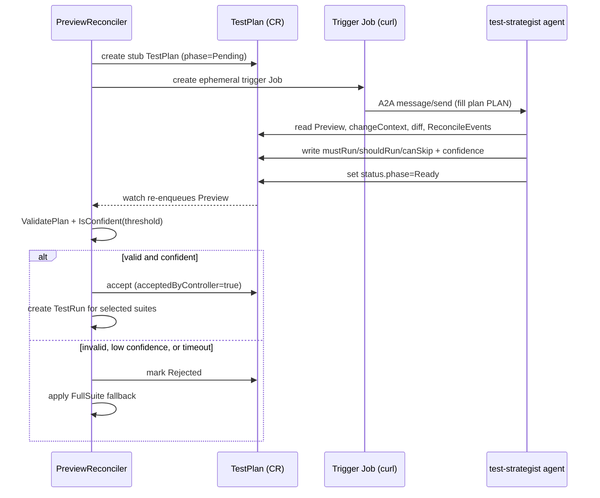

# AI Test Strategist

> A kagent-based AI agent that decides which test suites to run for a Preview from its PR diff, while the controller validates the decision and safely falls back to the full suite.

## Introduction

The AI Test Strategist lets a Preview run only the test suites that matter for a given change instead of always running everything. The kagent agent reads the Preview's change context and recent history, then writes a `TestPlan` listing the suites it considers mandatory (`mustRun`), recommended (`shouldRun`), or safe to skip (`canSkip`). The controller never trusts the agent blindly: it validates every plan against hard invariants and a confidence threshold before accepting it. If anything looks wrong, it discards the plan and runs the full suite.

## What it's for

CI feedback is slow when every pull request runs every suite, even a one-line docs change. This feature gives faster, targeted feedback by skipping irrelevant suites. It is safe because the agent has no authority of its own — the controller is the only component that decides what actually runs. A compromised or low-confidence agent can, at worst, propose a plan the controller then rejects.

## What it does

When a Preview sets `spec.testStrategy.mode: Auto`, the controller drives this ordered flow:

1. **Creates a stub `TestPlan`** for the Preview (phase `Pending`) carrying the commit SHA and correlation ID, then moves the Preview to phase `AwaitingTestPlan`.
2. **Creates an ephemeral trigger Job** (`curlimages/curl`) that sends one A2A `message/send` request poking the test-strategist agent to fill the named plan. The controller holds no HTTP client; the Job pod makes the call and exits.
3. **The agent fills the plan** — it reads the Preview's `changeContext`, the raw diff ConfigMap, and the last 20 `ReconcileEvents`, then writes `mustRun` / `shouldRun` / `canSkip`, a `confidence` (0–100), and a `rationale`, setting `generatedBy=Agent` and `status.phase=Ready`.
4. **The controller validates** the Ready plan: `mustRun ∩ canSkip` must be empty, and `confidence` must meet the threshold (default 70).
5. **Accept or fall back** — a valid, confident plan is accepted and drives a `TestRun`; an invalid or low-confidence plan is marked `Rejected` and the controller falls back to a FullSuite plan. If the agent never responds within `agentTimeoutSeconds`, the timeout fallback policy applies.

## How it works



Walkthrough: the controller and agent never call each other directly — Kubernetes CRDs are the bus. The agent only ever writes a `TestPlan`; the controller reads it. Acceptance happens in `acceptOrFallback`, which first calls `policy.ValidatePlan` (rejecting any plan where a selector appears in both `mustRun` and `canSkip`) and then `policy.IsConfident` against `policy.ConfidenceThreshold`. As a convenience, a plan whose spec is already filled (`generatedBy`, `confidence > 0`, non-empty `mustRun`) is promoted to `Ready` without the agent having to patch status separately. On timeout, `fallbackOnAgentTimeout` decides between running the full suite (`Full`), skipping tests (`Skip`), or erroring (`Error`).

The agent runs under a bounded ServiceAccount (`kagent-test-strategist`): `get/list/watch` on previews, testplans, and reconcileevents, plus `create/update/patch` on testplans and testplans/status — and nothing else (no deployments, pods, secrets, or testruns). Blast radius is bounded by the controller's policy, not the agent's good behavior.

## Relationships with other components

- [Change Context](./change-context.md) — supplies the `changedFiles`, `detectedImpacts`, and raw diff the agent reasons over.
- [Test Suites](./test-suites.md) — the suites (`smoke`, `contract`, `regression`, `e2e`, …) the plan selects among.
- [Security](./security.md) — the bounded-RBAC and validation argument that makes the agent safe.
- [AI Failure Analysis](./ai-failure-analysis.md) — the sibling agent that interprets results after tests run.
- [MCP Servers & Agent Tools](./mcp-servers.md) — the tools (`k8s_get_resources`, `k8s_apply_manifest`, …) this agent is granted.
- [Customizing AI Prompts](./ai-prompts.md) — where this agent's `systemMessage` lives and how to change it.
- Agent contract: [../agent-contract.md](https://github.com/ihsenalaya/preview-operator/blob/main/docs/agent-contract.md) — exact inputs the agent receives and outputs it must produce.

## Configuration

`spec.testStrategy.*` on a Preview:

| Field | Type | Default | Description |
|-------|------|---------|-------------|
| `mode` | `Auto` \| `Manual` \| `FullSuite` | `FullSuite` | `Auto` requests an agent plan; `Manual` uses `manualPlanRef`; `FullSuite` runs everything. |
| `confidenceThreshold` | int (0–100) | `70` | Minimum agent confidence to accept a plan; below this the controller falls back to FullSuite. |
| `agentTimeoutSeconds` | int (≥10) | `60` | How long the controller waits for the agent to fill the plan before applying the fallback. |
| `fallbackOnAgentTimeout` | `Full` \| `Skip` \| `Error` | `Full` | Action on agent timeout: run full suite, skip tests, or fail reconcile. |
| `manualPlanRef` | ObjectReference | — | TestPlan to use when `mode: Manual`. |

> Note: a Preview labelled `failure-provenance.experiment/owned: "true"` is always forced to FullSuite regardless of `mode`, so evaluation runs get deterministic suite coverage.

Minimal YAML enabling Auto mode:

```yaml
apiVersion: platform.company.io/v1alpha1
kind: Preview
metadata:
  name: pr-1234
spec:
  testStrategy:
    mode: Auto
    confidenceThreshold: 70
    agentTimeoutSeconds: 60
    fallbackOnAgentTimeout: Full
```

## Reference

- Strategy state machine, stub/trigger, accept/reject, fallback: [`../../internal/controller/testplan_strategy.go`](https://github.com/ihsenalaya/preview-operator/blob/main/internal/controller/testplan_strategy.go)
- TestPlan → Preview re-enqueue watcher: [`../../internal/controller/testplan_watcher.go`](https://github.com/ihsenalaya/preview-operator/blob/main/internal/controller/testplan_watcher.go)
- Validation, confidence threshold (70), agent timeout (60s), full-suite plan: [`../../internal/policy/testplan_policy.go`](https://github.com/ihsenalaya/preview-operator/blob/main/internal/policy/testplan_policy.go)
- TestPlan CRD types and phases (`Pending`/`Ready`/`Stale`/`Rejected`): [`../../api/v1alpha1/testplan_types.go`](https://github.com/ihsenalaya/preview-operator/blob/main/api/v1alpha1/testplan_types.go)
- `TestStrategySpec` fields and defaults: [`../../api/v1alpha1/preview_types.go`](https://github.com/ihsenalaya/preview-operator/blob/main/api/v1alpha1/preview_types.go)
- Agent contract (inputs/outputs): [../agent-contract.md](https://github.com/ihsenalaya/preview-operator/blob/main/docs/agent-contract.md)
- Architecture deep-dive (CRD bus, RBAC): [../test-strategy.md](https://github.com/ihsenalaya/preview-operator/blob/main/docs/test-strategy.md)
