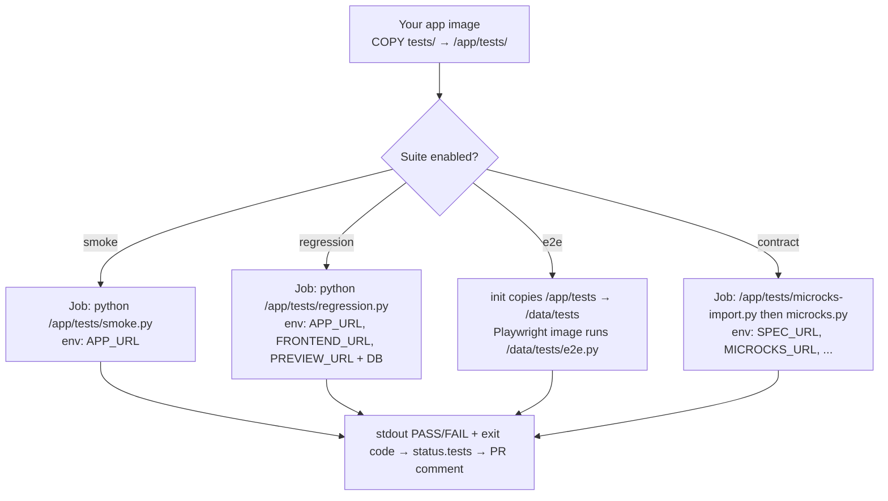

# Authoring Tests

> How to add your own smoke, regression, E2E, and contract tests so the operator runs them against every preview.

## Introduction
The operator runs your test suites as Kubernetes Jobs once a preview is `Running`
(see [Test Suites](./test-suites.md) for the pipeline). It does **not** ship the
tests themselves — you provide them. This guide shows the two ways to supply
tests: baking them into your application image (the normal path) and overriding
the default commands/images cluster-wide or per-preview.

## What it's for
Every team's tests are different, so the operator keeps the *what to test* in your
hands and only owns the *how to run it*: scheduling, ordering, DB isolation, URL
injection, and result reporting. You write plain scripts that hit the running
preview; the operator wires up the environment and grades pass/fail from their
output.

## What it does
For each enabled suite the operator launches a Job that, by default, runs a
script from a fixed path inside your app image and injects the preview's URLs (and
DB credentials, except for smoke). A line printed as `PASS ...` / `FAIL ...` is how
a suite reports per-check results; a non-zero exit fails the suite.

## How it works



The operator builds each Job's command from a default (or your override), mounts no
test code of its own, and reads the container's logs and exit code to populate
`status.tests`, which the [GitHub Integration](./github-integration.md) renders.

## The on-disk contract (bake tests into your image)
This is the recommended path. Put your scripts at these **fixed paths** in the app
image and the operator runs them as-is:

| Suite | Default command (path is fixed) | Runtime image | Gets DB creds |
|-------|----------------------------------|---------------|---------------|
| smoke | `python /app/tests/smoke.py` | your app image | no |
| regression | `python /app/tests/regression.py` | your app image | yes |
| e2e | `python /data/tests/e2e.py` (copied from `/app/tests/e2e.py`) | `mcr.microsoft.com/playwright/python:v1.44.0-jammy` | yes |
| migration | `alembic upgrade head` (see below) | your app image | yes |
| contract import | `python /app/tests/microcks-import.py` | your app image | no |
| contract tests | `python /app/tests/microcks.py` | your app image | no |

```dockerfile
# In your application's Dockerfile
COPY tests/ /app/tests/
# tests/smoke.py, tests/regression.py, tests/e2e.py, (optional) tests/microcks*.py
```

> **E2E runs in a different image.** Because Playwright needs a browser runtime,
> the operator copies `/app/tests/*` into an emptyDir and runs `e2e.py` in the
> Playwright image, not your app image. Keep `e2e.py` self-contained (it `pip install`s
> `requests` + `playwright` at startup by default).

### Environment your tests receive
The operator injects these so your scripts never hardcode URLs:

| Variable | Suites | Meaning |
|----------|--------|---------|
| `APP_URL` | smoke, regression, e2e | In-cluster URL of the app/backend service |
| `FRONTEND_URL` | regression, e2e | Frontend service URL (falls back to app in single-service) |
| `PREVIEW_URL` | regression, e2e | The public preview URL (`status.url`) |
| `CHECKPOINT_API` | e2e | Checkpoint HTTP API base (for `reset_db()` between flows — see [Database Checkpoints](./database-checkpoints.md)) |
| `POSTGRES_USER` / `POSTGRES_PASSWORD` / `POSTGRES_DB` / `DATABASE_URL` | regression, e2e, migration | DB credentials (only when `spec.database.enabled`) |

```python
# tests/smoke.py — the contract is just: print PASS/FAIL, exit non-zero on failure
import os, requests
base = os.environ["APP_URL"]
r = requests.get(f"{base}/healthz", timeout=10)
assert r.status_code == 200, f"FAIL smoke /healthz: {r.status_code}"
print("PASS smoke /healthz: 200")
```

## Overriding the defaults
You rarely need this, but two override layers exist. **Per-preview spec wins over
the ConfigMap, which wins over the built-in defaults.**

### Per-preview (spec) — change the image or command for one preview
`spec.testSuite.<suite>.image` and `spec.testSuite.<suite>.command` override
smoke, regression, e2e, and migration:

```yaml
spec:
  testSuite:
    enabled: true
    regression:
      enabled: true
      image: ghcr.io/acme/test-runner:latest   # run regression in a dedicated image
      command: ["pytest", "-q", "tests/api"]    # and a custom command
```

### Cluster-wide (ConfigMap) — change the defaults for every preview
Create a `preview-test-scripts` ConfigMap in the **operator namespace**
(`preview-operator-system`). Only these keys are honored; missing keys fall back to
the built-in defaults:

| Key | Overrides |
|-----|-----------|
| `migration.command` | the migration Job command |
| `regression.command` | the regression Job command |
| `e2e.image` | the E2E runtime image |
| `e2e.command` | the E2E Job command |

```bash
kubectl create configmap preview-test-scripts -n preview-operator-system \
  --from-literal=regression.command='pytest -q /app/tests/api' \
  --from-literal=e2e.image='mcr.microsoft.com/playwright/python:v1.47.0-jammy'
```

> **Smoke and contract paths are fixed.** `/app/tests/smoke.py`,
> `/app/tests/microcks-import.py`, and `/app/tests/microcks.py` are hardcoded — they
> can only be changed by overriding the smoke `command`/`image` in the spec (smoke)
> or by editing the files in your image (contract). The ConfigMap does not cover them.

## Contract tests (Microcks)
> For the full mechanics — the two Jobs, Keycloak auth, and the protocol — see the
> [Microcks Contract Testing deep dive](./microcks-contract-testing.md).

Contract testing has two steps and needs a reachable Microcks instance:

1. **Import** (optional) — if `spec.testSuite.contractTesting.specURL` is set, the
   operator runs `microcks-import.py` with `SPEC_URL` + Microcks credentials so your
   script imports the OpenAPI spec into Microcks.
2. **Test** — when `contractTesting.enabled`, it runs `microcks.py` with
   `MICROCKS_URL`, `BACKEND_URL`, `API_NAME`, `API_VERSION`, `TEST_RUNNER`, etc., so
   your script invokes the Microcks test runner against the preview.

```yaml
spec:
  testSuite:
    enabled: true
    contractTesting:
      enabled: true
      microcksURL: http://microcks.microcks.svc.cluster.local:8080
      specURL: https://raw.githubusercontent.com/acme/app/main/api/openapi.yaml
      apiName: "Acme Catalog API"
      apiVersion: "1.0.0"
```

## Relationships with other components
- [Test Suites](./test-suites.md) — how/when each suite runs, ordering, and DB isolation.
- [AI Test Strategist](./ai-test-strategist.md) — decides *which* of your suites run for a given diff; you still author the suites here.
- [Database Checkpoints](./database-checkpoints.md) — the `CHECKPOINT_API` your E2E tests use to reset DB state between flows.
- [GitHub Integration](./github-integration.md) — renders the pass/fail your scripts print.

## Configuration
| Field | Default | Purpose |
|-------|---------|---------|
| `spec.testSuite.enabled` | `false` | Master switch for the suite pipeline |
| `spec.testSuite.smoke` / `regression` / `e2e` | enabled when block omitted | Per-suite toggle + `image`/`command` overrides |
| `spec.testSuite.migration` | `false` | DB migration step toggle + overrides |
| `spec.testSuite.contractTesting` | `false` | Microcks contract testing (see above) |
| `preview-test-scripts` ConfigMap | absent → built-in defaults | Cluster-wide command/image overrides |

## Reference
- Job construction, paths, env vars: [`../../internal/controller/tests.go`](https://github.com/ihsenalaya/preview-operator/blob/main/internal/controller/tests.go)
- Override loading & default commands: [`../../internal/controller/test_scripts_loader.go`](https://github.com/ihsenalaya/preview-operator/blob/main/internal/controller/test_scripts_loader.go)
- Suite spec types: [`../../api/v1alpha1/preview_types.go`](https://github.com/ihsenalaya/preview-operator/blob/main/api/v1alpha1/preview_types.go) — `TestSuiteSpec`, `TestJobSpec`, `ContractTestingSpec`
- Example app tests: [`../../demo-app/`](https://github.com/ihsenalaya/preview-operator/blob/main/demo-app/)
