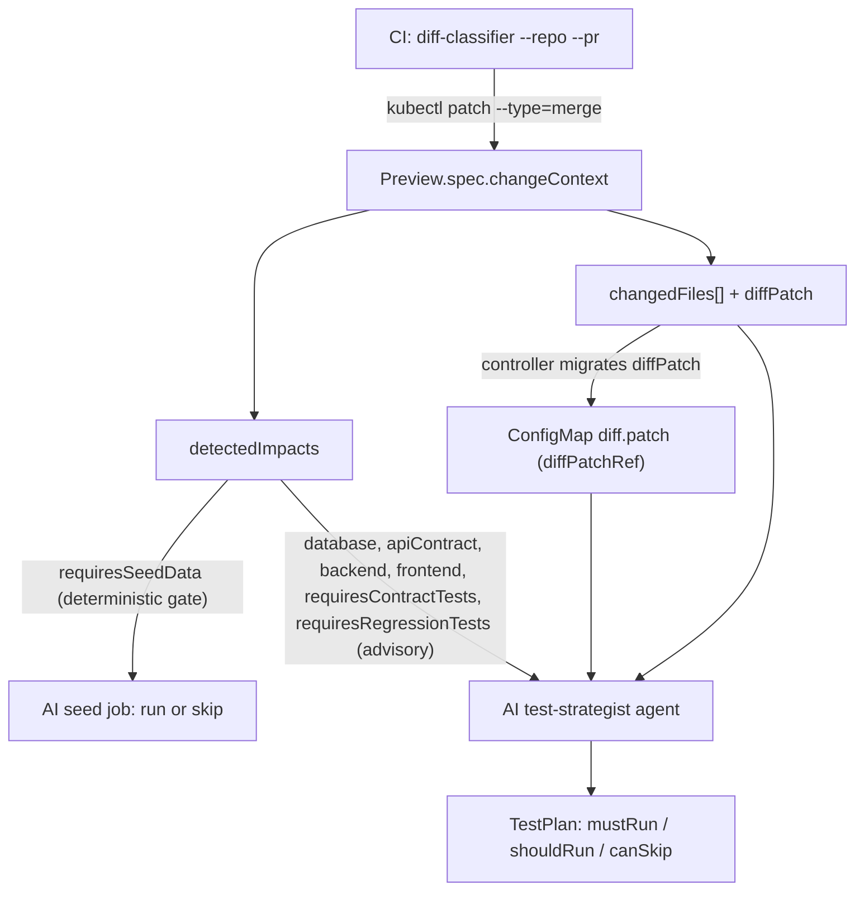

# Change Context

> The pull request diff, classified in CI, becomes a first-class reconciliation input (`spec.changeContext`) that the controller and AI agents read to adapt a preview to what actually changed.

## Introduction
Change Context turns "what changed in this PR" into structured data on the `Preview` CR. A small CLI (`diff-classifier`) runs in GitHub Actions, queries the PR diff, classifies every changed file, and patches the resulting metadata into `spec.changeContext`. The controller and the AI test-strategist agent then consume that metadata instead of re-fetching or guessing.

## What it's for
Provisioning a full preview stack for every PR is wasteful, and asking the controller to fetch and reason about diffs at reconcile time couples it to GitHub. Change Context solves both: the diff is classified once, in CI (which already holds the GitHub token), and the result travels with the CR as plain, declarative fields. This keeps the controller offline-friendly while giving downstream consumers a precise, structured view of the change.

## What it does
- Classifies the PR diff in CI: `diff-classifier` reads the GitHub PR, tags each file with a `ChangeFileType`, and derives `detectedImpacts`.
- Populates `spec.changeContext`: emits a JSON merge-patch (`{"spec":{"changeContext":{...}}}`) applied with `kubectl patch --type=merge`.
- Migrates the raw diff: when the classifier embeds `diffPatch` inline, the controller moves it into a per-preview ConfigMap on first reconcile, sets `diffPatchRef`, and clears the inline field.
- Lets consumers read it: `requiresSeedData` deterministically gates the AI seed job; all other impacts plus `changedFiles` and the raw diff are advisory inputs to the AI test-strategist agent.

## How it works



Walkthrough. `diff-classifier` classifies each file by path/extension (first match wins) and folds those types into `detectedImpacts`. The controller then enforces exactly one deterministic gate: when `spec.changeContext` is set and `detectedImpacts.requiresSeedData` is `false` (and no explicit `spec.aiEnrichment.seed.enabled` is given), the AI seed job is skipped (`ai_enrichment.go`, `aiSeedEnabled`, ~line 110). Every other impact field is **advisory**: the AI test-strategist agent reads them — alongside `changedFiles` and the raw diff — to decide which suites to run, but they are **not** controller gates. Database provisioning and the contract/regression suites remain governed by their own `spec.*` flags (`spec.database.enabled`, `spec.testSuite.contractTesting.enabled`, the accepted `TestPlan`). An earlier version of this doc overstated these as gates; they are signals, not switches.

## Relationships with other components
- [AI Test Strategist](./ai-test-strategist.md) — primary advisory consumer; turns impacts, `changedFiles`, and the diff into a `TestPlan`.
- [AI Enrichment](./ai-enrichment.md) — owns the seed job gated by `requiresSeedData`.
- [Test Suites](./test-suites.md) — the smoke/contract/regression/e2e suites whose execution is selected by the `TestPlan`, not directly by Change Context.

## Configuration
`spec.changeContext.*`:

| Field | Type | Meaning |
|---|---|---|
| `diffRef` | object | VCS provenance: `provider`, `repository`, `pullRequestNumber`, `baseSHA`, `headSHA`. |
| `summary` | object | Aggregate stats: `changedFilesCount`, `additions`, `deletions`. |
| `changedFiles[]` | list | Each entry: `path` + classified `type` (`database-migration`, `api-contract`, `backend`, `frontend`, `docs`, `other`). |
| `detectedImpacts` | object | Boolean impact flags (below). |
| `diffPatch` | string | Raw `git diff base...head`, ≤ 64 KiB. Set by the classifier; migrated out by the controller. |
| `diffPatchRef` | string | Name of the ConfigMap holding the diff under key `diff.patch`. Set by the controller. |

`spec.changeContext.detectedImpacts.*`:

| Field | Effect |
|---|---|
| `requiresSeedData` | **Deterministic gate.** `false` skips the AI seed job (unless `spec.aiEnrichment.seed.enabled` overrides). |
| `database` | Advisory. Diff touches DB migrations. Does not provision; `spec.database.enabled` does. |
| `apiContract` | Advisory. Hints contract relevance to the agent; contract tests gated by `spec.testSuite.contractTesting.enabled` / `TestPlan`. |
| `backend` | Advisory. Hints regression relevance to the agent. |
| `frontend` | Advisory. Hints e2e relevance to the agent. |
| `requiresContractTests` | Advisory. Suggestion to the agent only. |
| `requiresRegressionTests` | Advisory. Suggestion to the agent only. |

Minimal example:

```yaml
apiVersion: platform.company.io/v1alpha1
kind: Preview
metadata:
  name: pr-42
spec:
  branch: feature/orders
  prNumber: 42
  image: ghcr.io/ihsenalaya/idp-preview:sha-abc123
  changeContext:
    diffRef:
      repository: ihsenalaya/idp-preview
      pullRequestNumber: 42
      headSHA: abc123
    changedFiles:
      - path: db/migrations/20260510_add_orders.sql
        type: database-migration
      - path: src/orders/service.py
        type: backend
    detectedImpacts:
      database: true               # advisory
      backend: true                # advisory
      requiresSeedData: true       # deterministic gate -> AI seed runs
      requiresRegressionTests: true # advisory
```

`spec.changeContext` is optional; a `Preview` without it behaves exactly as before.

## Reference
- Classifier CLI: [`../../cmd/diff-classifier/main.go`](https://github.com/ihsenalaya/preview-operator/blob/main/cmd/diff-classifier/main.go)
- Classification rules: [`../../pkg/changecontext/classifier/classifier.go`](https://github.com/ihsenalaya/preview-operator/blob/main/pkg/changecontext/classifier/classifier.go)
- API types: [`../../api/v1alpha1/preview_types.go`](https://github.com/ihsenalaya/preview-operator/blob/main/api/v1alpha1/preview_types.go) (`ChangeContextSpec`, `ChangedFile`, `ChangeFileType`, `DetectedImpacts`)
- Seed gate: [`../../internal/controller/ai_enrichment.go`](https://github.com/ihsenalaya/preview-operator/blob/main/internal/controller/ai_enrichment.go) (`aiSeedEnabled`, ~line 110)
- `diffPatch` -> ConfigMap migration: [`../../internal/controller/preview_controller.go`](https://github.com/ihsenalaya/preview-operator/blob/main/internal/controller/preview_controller.go) (`migrateDiffPatch`)
- Agent consumption contract: [`../agent-contract.md`](https://github.com/ihsenalaya/preview-operator/blob/main/docs/agent-contract.md)
