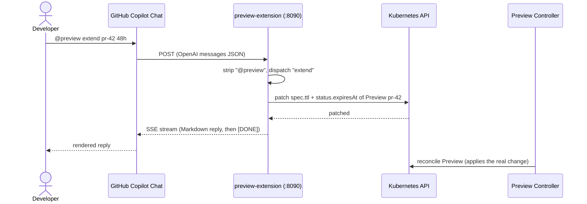

# Copilot Extension

> A sidecar HTTP server that lets developers drive preview environments from GitHub Copilot Chat with `@preview` commands — no `kubectl` access required.

## Introduction

The Copilot Extension (`preview-extension`) is an optional companion server that turns GitHub Copilot Chat into a ChatOps console for previews. It speaks GitHub's OpenAI-compatible streaming protocol: Copilot POSTs the user's message, the server strips the `@preview` prefix, dispatches the first word to a command handler, and streams back a Markdown reply over Server-Sent Events. Every handler does one of two things — read a `Preview` CR (status, logs, checkpoints) or patch one to request work — so the server stays a thin facade over the same CRD bus the controller already watches.

## What it's for

Developers want to inspect, extend, and reset their preview environment from where they already work — the PR conversation — without learning `kubectl`, holding cluster credentials, or context-switching to a terminal. The extension solves this by mapping plain-language commands typed in Copilot Chat onto safe, RBAC-scoped reads and patches of the `Preview` custom resource.

## What it does

- Parses the last `user` message, strips the `@preview` / `@preview ` prefix, lowercases the first word, and dispatches it through a `switch` in [`server.go`](https://github.com/ihsenalaya/preview-operator/blob/main/internal/extension/server.go).
- Resolves the target environment from a flexible PR argument: `pr-42`, `42`, and `#42` all map to the Preview named `pr-42`.
- Reads Preview status/logs, or patches `spec` / `status` fields to ask the controller to do the actual work.
- Exposes a separate JSON checkpoint HTTP API under `/api/previews/...` used by E2E tests.
- Replies in Markdown, streamed back as OpenAI SSE chunks ending with `[DONE]`.

Command reference — exactly the cases handled by the dispatch switch (aliases in parentheses):

| Command | What it does | Effect (CR field / read) |
|---|---|---|
| `status pr-N` | Detailed environment report: phase, URL, branch, tier, replicas, uptime, TTL, DB, GitHub deployment, AI, crash diagnostics. Empty arg falls back to `list`. | Reads the `Preview` (`spec` + `status`) |
| `logs pr-N` | Last 40 lines from the app pod (`app=preview-preview`, container `app`); falls back to `status.diagnostics.podLogs`. | Reads pod logs / `status.diagnostics` |
| `extend pr-N [24h]` | Extends the TTL by a duration (default `24h`). | Patches `spec.ttl` **and** `status.expiresAt` |
| `wake pr-N` | Restarts a scaled-down environment (no-op if already > 0 replicas). | Patches `spec.replicas = 1` |
| `reset-db pr-N` (`resetdb`) | Recreates the database and replays migration + seed. | Patches `spec.database.resetRequested = true` |
| `save-db pr-N NAME` (`savedb`) | Saves a named DB checkpoint snapshot. | Patches `spec.database.checkpointSave` |
| `restore-db pr-N NAME` (`restoredb`) | Restores the DB from a named checkpoint. | Patches `spec.database.checkpointRestore` |
| `list-checkpoints pr-N` (`listcheckpoints`) | Lists available DB checkpoints. | Reads `status.database.checkpoints` |
| `run-sql pr-N <sql>` (`runsql`) | Runs arbitrary SQL against the preview database. | Creates a one-shot `psql` Job in the preview namespace |
| `retest-ai pr-N` (`retestai`) | Triggers an AI-only enrichment rerun. | Patches `spec.aiEnrichment.rerunRequested = true` |
| `enrich pr-N` | **Alias of `retest-ai`** — `cmdEnrich` calls `cmdRetestAI`. | Same as `retest-ai` |
| `set-prompt pr-N <text>` (`setprompt`) | Sets custom AI instructions for the environment. | Creates/patches ConfigMap `ai-prompt-pr-N` in `preview-operator-system` |
| `show-prompt pr-N` (`showprompt`) | Shows the current custom AI prompt. | Reads ConfigMap `ai-prompt-pr-N` |
| `list` | Lists all active environments (name, branch, phase, TTL). | Lists all `Preview` CRs |
| `help` (also empty input) | Shows the command help table. | None |

Any other first word returns "Commande inconnue" followed by the help table.

## How it works



The server's `ServeHTTP` handles three routes: `/healthz` (liveness), `/api/previews/...` (the checkpoint API, below), and any other POST (the Copilot chat protocol). For chat requests it reads the last `user` message, calls `execute`, and streams the result as two OpenAI `chat.completion.chunk` SSE frames followed by `data: [DONE]`.

Crucially, the extension never provisions, migrates, scales, or runs tests itself. With the sole exception of `run-sql` and the E2E restore path (which create one-shot Jobs), every command only **reads** a CR or **patches** a `spec`/`status` field. The Preview controller watches those fields and performs the actual work on its next reconcile — the same CRD-as-bus principle the rest of the operator uses, which keeps the chat surface stateless and the authority centralized in the controller.

### Checkpoint HTTP API (E2E)

Requests to `/api/previews/<name>/checkpoints...` are routed to [`checkpoint_api.go`](https://github.com/ihsenalaya/preview-operator/blob/main/internal/extension/checkpoint_api.go), giving E2E suites a synchronous JSON API:

- `GET /api/previews/<name>/checkpoints` — list checkpoints (`{"checkpoints":[...]}`).
- `POST /api/previews/<name>/checkpoints/<cp>` — save: patches `spec.database.checkpointSave` and **waits** until the controller clears it, then returns the updated list.
- `POST /api/previews/<name>/checkpoints/<cp>/restore` — restore: instead of patching the spec, it creates a uniquely-named one-shot restore Job (`ext-restore-<cp>-<ts>`) that TRUNCATEs `public` tables and replays the `db-checkpoint-<cp>` dump, then waits for the Job to finish. The unique name avoids the shared-Job race that made rapid `reset_db()` calls time out.

Checkpoint names are validated (`^[a-z0-9]([-a-z0-9]*[a-z0-9])?$`, max 48 chars).

## Relationships with other components

- [Database Checkpoints](./database-checkpoints.md) — `save-db` / `restore-db` / `list-checkpoints` and the checkpoint HTTP API drive this feature.
- [AI Enrichment](./ai-enrichment.md) — `retest-ai` / `enrich`, `set-prompt`, and `show-prompt` control AI-generated seeds and tests.
- [Lifecycle & Provisioning](./lifecycle.md) — `status`, `extend`, and `wake` read and adjust phase, TTL, and replica state.
- [Test Suites](./test-suites.md) — the checkpoint API gives E2E suites a deterministic database reset between cases.

## Configuration

The extension ships as a standalone binary built from [`cmd/extension/main.go`](https://github.com/ihsenalaya/preview-operator/blob/main/cmd/extension/main.go) via [`Dockerfile.extension`](https://github.com/ihsenalaya/preview-operator/blob/main/Dockerfile.extension) (distroless, non-root). Deploy with the manifests under [`config/extension/`](https://github.com/ihsenalaya/preview-operator/blob/main/config/extension):

```bash
kubectl apply -f config/extension/rbac.yaml
kubectl apply -f config/extension/deployment.yaml
kubectl -n preview-operator-system rollout status deployment/preview-extension --timeout=60s

# Expose for local Kind via ngrok, then paste the HTTPS URL as the GitHub App webhook URL
kubectl port-forward -n preview-operator-system svc/preview-extension 8090:8090 &
ngrok http 8090
```

- **Service:** `preview-extension` (ClusterIP, port `8090`) in namespace `preview-operator-system`.
- **Server config:** `LISTEN_ADDR` (default `:8090`) and the optional `GITHUB_WEBHOOK_SECRET` env var.
- **Secret (optional):** `preview-extension-secret` with key `webhook-secret`, e.g. `kubectl create secret generic preview-extension-secret -n preview-operator-system --from-literal=webhook-secret="$(openssl rand -hex 32)"`.
- **RBAC** (ServiceAccount `preview-extension`, ClusterRole in `rbac.yaml`): `previews` (get/list/watch/patch/update), `previews/status` (get/patch/update), `pods` (get/list/watch), `pods/log` (get), `configmaps` (get/create/patch/update/delete), `jobs` (get/list/watch/create/delete).

The extension is **optional** — the operator and all preview functionality work without it; it only adds the ChatOps surface.

## Reference

- [`internal/extension/server.go`](https://github.com/ihsenalaya/preview-operator/blob/main/internal/extension/server.go) — HTTP routing, `@preview` prefix stripping, dispatch switch, SSE streaming.
- [`internal/extension/commands.go`](https://github.com/ihsenalaya/preview-operator/blob/main/internal/extension/commands.go) — per-command handlers and the CR fields each one reads or patches.
- [`internal/extension/checkpoint_api.go`](https://github.com/ihsenalaya/preview-operator/blob/main/internal/extension/checkpoint_api.go) — the E2E checkpoint HTTP API and the unique-named restore Job.
- [`cmd/extension/main.go`](https://github.com/ihsenalaya/preview-operator/blob/main/cmd/extension/main.go) — process entrypoint: clients, scheme, `LISTEN_ADDR`, server start.
- [`Dockerfile.extension`](https://github.com/ihsenalaya/preview-operator/blob/main/Dockerfile.extension) · [`config/extension/`](https://github.com/ihsenalaya/preview-operator/blob/main/config/extension) — image build and deployment manifests.
