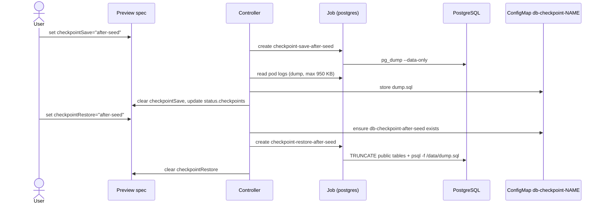

# Database Checkpoints

> Save and restore a deterministic database state so every smoke, regression, and E2E run starts from the same seed.

## Introduction

A checkpoint is a point-in-time, data-only snapshot of the preview's PostgreSQL database, captured with `pg_dump --data-only` and stored in a Kubernetes ConfigMap inside the preview namespace. The operator saves and restores checkpoints on demand by spawning short-lived Jobs, and the Preview Extension exposes the same capability over HTTP so E2E tests can reset the database between cases. This is the foundation of the test suite's inter-suite isolation.

## What it's for

Tests that mutate the database are order-dependent and flaky unless each one starts from a known state. Re-running migrations and seeds before every test is correct but slow. Checkpoints solve this by capturing the seeded state once and replaying it cheaply (TRUNCATE + restore), giving each suite — and each individual E2E case — a deterministic starting point at a fraction of the cost of a full migration replay.

## What it does

- Saves a snapshot when `spec.database.checkpointSave` is set: runs a `pg_dump --data-only --no-owner --no-privileges` Job and stores the dump in a ConfigMap.
- Restores a snapshot when `spec.database.checkpointRestore` is set: TRUNCATEs all `public` tables (`RESTART IDENTITY CASCADE`), then replays the saved `dump.sql`.
- Clears `checkpointSave` / `checkpointRestore` from the spec automatically once the Job succeeds.
- Lists available checkpoints in `status.database.checkpoints`, derived from ConfigMaps named `db-checkpoint-*`.
- Rejects setting both `checkpointSave` and `checkpointRestore` at the same time.
- Enforces the size limit: a dump larger than ~950 KB fails because it cannot fit in a ConfigMap.
- Exposes an HTTP API (`/api/previews/<name>/checkpoints/...`) used by E2E tests to list, save, and restore.

## How it works



On **save**, the controller creates `checkpoint-save-<name>`, waits for it to succeed, reads the dump from the Job pod's logs via the Kubernetes client (capped at 950 KB), and writes it to ConfigMap `db-checkpoint-<name>` under key `dump.sql`. On **restore**, the dump is mounted from that ConfigMap into the `checkpoint-restore-<name>` Job, which truncates every `public` table and replays the SQL. Both Jobs use `postgres:<version>-alpine` and self-delete after success (TTL 300s).

## Relationships with other components

- [Ephemeral PostgreSQL](./ephemeral-postgres.md) — checkpoints snapshot and reset the database this provisions; requires `spec.database.enabled: true`.
- [Test Suites](./test-suites.md) — drives inter-suite isolation; `isolationMode: restore` saves an `after-seed` checkpoint and restores it between regression and E2E stages.
- [Copilot Extension](./copilot-extension.md) — serves the checkpoint HTTP API that E2E test scripts call (`CHECKPOINT_API`) to reset the DB before each case.

## Configuration

| Field | Type | Effect |
|---|---|---|
| `spec.database.checkpointSave` | string | Triggers a save under this name; cleared by the operator on success. |
| `spec.database.checkpointRestore` | string | Triggers a restore from this name; cleared on success. |
| `status.database.checkpoints` | []string | Sorted list of available checkpoint names (read-only). |

**Name rules** (same in controller and extension): must match `^[a-z0-9]([-a-z0-9]*[a-z0-9])?$`, max 48 characters, start and end with an alphanumeric character. Only one of save/restore may be set at a time.

**`@preview` commands** (Copilot Extension): `@preview save-db <name>` and `@preview restore-db <name>` invoke the HTTP API below.

**Checkpoint HTTP API** (Preview Extension, used by E2E tests):

| Method & path | Action |
|---|---|
| `GET /api/previews/<name>/checkpoints` | List checkpoint names. |
| `POST /api/previews/<name>/checkpoints/<cp>` | Save: patches `checkpointSave`, waits for completion. |
| `POST /api/previews/<name>/checkpoints/<cp>/restore` | Restore: runs a uniquely-named `ext-restore-<cp>-<ts>` Job directly (avoids the shared-Job race when E2E fires many `reset_db()` calls). |

Minimal YAML and a typical E2E reset call:

```yaml
spec:
  database:
    enabled: true
    checkpointSave: after-seed     # operator clears this once saved
    # checkpointRestore: after-seed  # set instead to restore
```

```python
# E2E: reset DB before every case via the injected CHECKPOINT_API
import os, requests

def reset_db():
    api = os.environ.get("CHECKPOINT_API", "")
    if api:
        requests.post(f"{api}/checkpoints/after-seed/restore", timeout=60)
```

## Reference

- Controller save/restore reconcile, storage, size limit, naming: [`../../internal/controller/checkpoint.go`](https://github.com/ihsenalaya/preview-operator/blob/main/internal/controller/checkpoint.go)
- Checkpoint HTTP API for E2E: [`../../internal/extension/checkpoint_api.go`](https://github.com/ihsenalaya/preview-operator/blob/main/internal/extension/checkpoint_api.go)
- API types (`checkpointSave` / `checkpointRestore`, `status.database.checkpoints`): [`../../api/v1alpha1/preview_types.go`](https://github.com/ihsenalaya/preview-operator/blob/main/api/v1alpha1/preview_types.go)
- CR & status fields: [`../../README.md`](https://github.com/ihsenalaya/preview-operator/blob/main/README.md) — "Complete CR Reference" and "Status Fields Reference"
- Related: [Ephemeral PostgreSQL](./ephemeral-postgres.md), [Test Suites](./test-suites.md), [Copilot Extension](./copilot-extension.md)
