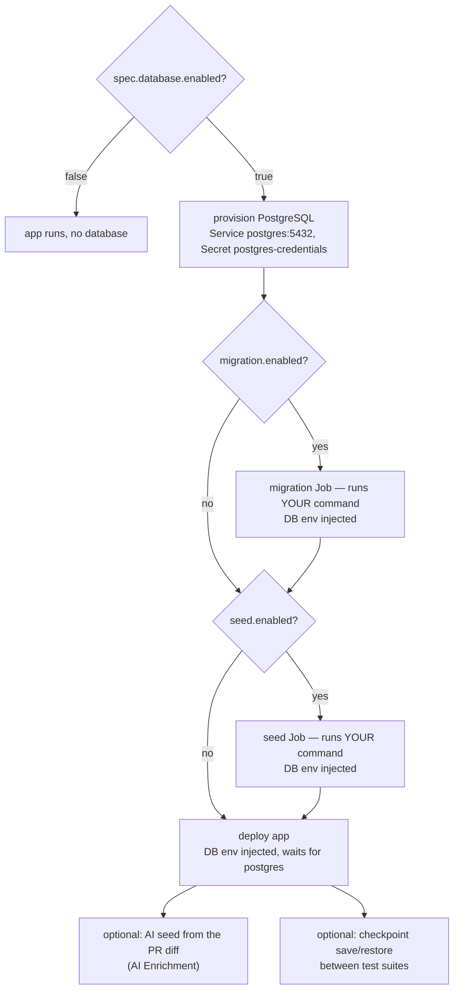

# Database Management

> The scenarios for giving a preview a database — schema, seed data, isolation, reset — and exactly what you provide and where.

## Introduction
A preview can run with its own throwaway PostgreSQL. This guide is the practical
map: the common scenarios (no DB → DB → migrations → seed → AI seed → isolation →
reset), how to configure each, and — the question people hit first — **where your
migration and seed files go**. The low-level mechanics live in
[Ephemeral PostgreSQL](./ephemeral-postgres.md) and [Database Checkpoints](./database-checkpoints.md);
this guide ties them together by use case.

## What it's for
Most apps need a database with a known schema and some data to be testable. The
operator provisions a fresh PostgreSQL per preview, runs **your** migration and
seed steps before the app starts, and (optionally) keeps a deterministic starting
state across test suites. You stay in control of *what* the schema and data are;
the operator owns *when* and *how* they run, plus credentials and isolation.

## What it does
- Provisions a per‑preview PostgreSQL (`postgres:<version>-alpine`, Service `postgres:5432`) with a generated Secret `postgres-credentials`.
- Injects `POSTGRES_USER`, `POSTGRES_PASSWORD`, `POSTGRES_DB`, `DATABASE_URL` into the migration Job, the seed Job, and **every app pod** (each waits for PostgreSQL via an init container).
- Runs an optional **migration** Job (your command) before the app, then an optional **seed** Job (your command) before the app.
- Optionally generates **AI seed data** from the PR diff after the app is `Running` (see [AI Enrichment](./ai-enrichment.md)).
- Keeps suites isolated with save/restore **checkpoints**, and supports **on‑demand reset**.

## How it works



Order is fixed: **PostgreSQL ready → migration → seed → app**. Migration and seed are
one‑shot Jobs in the preview namespace; if either has no command it is a no‑op. The
app only starts once the database is up.

## Scenarios — what to set
| Scenario | Set this | You provide |
|----------|----------|-------------|
| **No database** (default) | nothing | — |
| **Empty database** | `database.enabled: true` | — (empty `appdb`) |
| **Schema via migrations** | `database.migration.enabled: true` + `command` | your migration files in the app image (e.g. Alembic `migrations/`) |
| **Migrations + static seed** | add `database.seed.enabled: true` + `command` | a seed script/SQL in the app image |
| **AI‑generated seed** | `aiEnrichment.enabled: true` (instead of static seed) | nothing — generated from the diff ([AI Enrichment](./ai-enrichment.md)) |
| **Deterministic test isolation** | on by default (`database.isolationEnabled`) | nothing — checkpoint saved/restored per suite ([Checkpoints](./database-checkpoints.md)) |
| **Reset the database** | `database.resetRequested: true` or `@preview reset-db pr-N` | — (migration + seed re‑run) |
| **Manual snapshot/restore** | `database.checkpointSave` / `checkpointRestore`, or `@preview save-db`/`restore-db` | — |

## Where to put your files
This is the key difference from [test scripts](./authoring-tests.md): the database
steps have **no fixed path**. You give the operator a **command**, and it runs that
command **in your app image** with the database environment injected. So your files
go wherever *your* tool expects them inside the image — there is nothing to match an
operator‑owned path.

What your migration/seed command can rely on at runtime:

| Variable | Value |
|----------|-------|
| `DATABASE_URL` | `postgresql://<user>:<pass>@postgres:5432/<dbName>?sslmode=disable` |
| `POSTGRES_USER` / `POSTGRES_PASSWORD` / `POSTGRES_DB` | the generated credentials and DB name |
| host / port | Service `postgres`, port `5432` |

**Migrations (Alembic example, as in idp-preview).** Bake your Alembic config and
versions into the image, then point the command at them:

```dockerfile
# in your app's Dockerfile
COPY alembic.ini .
COPY migrations/ ./migrations/      # migrations/versions/001_initial_schema.py, ...
```
```yaml
spec:
  database:
    enabled: true
    migration:
      enabled: true
      command: ["alembic", "upgrade", "head"]   # reads alembic.ini → migrations/
```

**Static seed.** Same idea — ship a script or SQL file and run it:

```yaml
spec:
  database:
    seed:
      enabled: true
      command: ["python", "seed.py"]            # or: ["psql", "-f", "/app/seed.sql"]
```

Both steps default their image to `spec.image`; set `migration.image` / `seed.image`
to run them in a different image. If you'd rather not write seed data by hand, skip
`seed` and enable [AI Enrichment](./ai-enrichment.md) to generate it from the diff.

## Relationships with other components
- [Ephemeral PostgreSQL](./ephemeral-postgres.md) — the provisioning mechanics, credentials, and init‑container wait.
- [Database Checkpoints](./database-checkpoints.md) — save/restore that isolates each test suite and powers `@preview save-db`/`restore-db`.
- [AI Enrichment](./ai-enrichment.md) — the alternative to static seed: LLM‑generated, PR‑relevant data.
- [Test Suites](./test-suites.md) — consumes the seeded, isolated database; migration changes also trigger the migration validation suite.
- [Copilot Extension](./copilot-extension.md) — `@preview reset-db` / `save-db` / `restore-db` / `run-sql`.

## Configuration
| Field | Default | Purpose |
|-------|---------|---------|
| `spec.database.enabled` | `false` | Provision PostgreSQL for the preview |
| `spec.database.version` | `"15"` | PostgreSQL major version (`postgres:<v>-alpine`) |
| `spec.database.databaseName` | `"appdb"` | Logical database name |
| `spec.database.migration.enabled` / `.command` / `.image` | `false` / — / `spec.image` | One‑shot migration before the app |
| `spec.database.seed.enabled` / `.command` / `.image` | `false` / — / `spec.image` | One‑shot seed after migration, before the app |
| `spec.database.resetRequested` | `false` | Delete + re‑run migration and seed (auto‑cleared) |
| `spec.database.checkpointSave` / `.checkpointRestore` | — | Named `pg_dump` snapshot / restore (auto‑cleared) |
| `spec.database.isolationEnabled` | `true` | Save/restore a checkpoint between test suites |
| `spec.database.isolationMode` | `restore` | `restore` (pg_dump+psql) or `migration` (DROP SCHEMA + re‑run migration) |

```yaml
apiVersion: platform.company.io/v1alpha1
kind: Preview
metadata:
  name: pr-42
spec:
  image: ghcr.io/acme/app:pr-42
  database:
    enabled: true
    version: "15"
    migration:
      enabled: true
      command: ["alembic", "upgrade", "head"]
    seed:
      enabled: true
      command: ["python", "seed.py"]
```

## Reference
- Provisioning, migration/seed Jobs, injected env, reset: [`../../internal/controller/preview_controller.go`](https://github.com/ihsenalaya/preview-operator/blob/main/internal/controller/preview_controller.go) (`reconcileDatabase`, `postgresSecretName`)
- Checkpoints & isolation (save/restore, DROP SCHEMA): [`../../internal/controller/checkpoint.go`](https://github.com/ihsenalaya/preview-operator/blob/main/internal/controller/checkpoint.go)
- Spec types: [`../../api/v1alpha1/preview_types.go`](https://github.com/ihsenalaya/preview-operator/blob/main/api/v1alpha1/preview_types.go) — `DatabaseSpec`, `DatabaseTaskSpec`
- Example app DB layout: [`../../README.md`](https://github.com/ihsenalaya/preview-operator/blob/main/README.md) (Ephemeral PostgreSQL) and the Alembic `migrations/` convention
