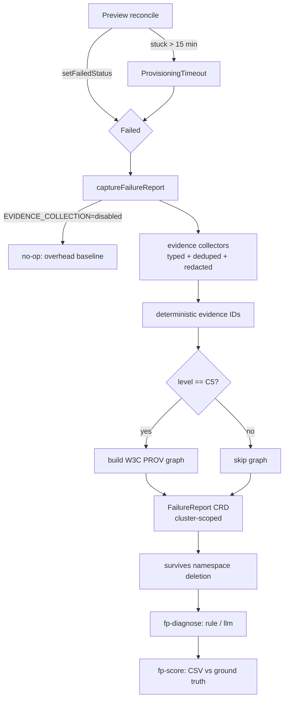

# Failure Provenance

> A cluster-scoped `FailureReport` CRD that captures a structured, W3C PROV-aligned evidence bundle for every failed Preview and preserves it past namespace teardown.

## Introduction

When an ephemeral preview fails, its namespace is eventually torn down and the
evidence — pod logs, events, test output, the diff that caused it — disappears
with it. Failure Provenance (shipped in 1.1.0) snapshots that evidence into a
typed, addressable, deterministic bundle and persists it as a cluster-scoped
`FailureReport` (shortname `fr`) that outlives the namespace. The bundle is
modelled on W3C PROV, so a downstream diagnostic step can cite specific
evidence by ID rather than guessing.

## What it's for

Preview failures are transient and the diagnostic signal is destroyed by
teardown, which makes post-mortems and any offline accuracy evaluation
impossible. Failure Provenance solves this by producing a **durable, auditable,
grounded** failure record: every probable cause is tied to evidence items that
demonstrably exist in the same report, and the record survives `kubectl delete
preview`. It is the foundation for reproducible, offline failure diagnosis.

## What it does

- Detects a `Failed` Preview (any `setFailedStatus` path) or a `ProvisioningTimeout` and triggers capture.
- Runs evidence collectors over signals already on the Preview (no extra Kubernetes API calls) to build a typed bundle: `GitDiff`, `ChangedFile`, `KubernetesEvent`, `PodLog`, `JobLog`, `TestResult`, `TraceSpan`, `Metric`, `PreviewCondition`, `ReconcileEvent`.
- Assigns each item a **deterministic ID** derived from `(type, source, resource, content)`, so re-reconciliation is idempotent and never duplicates evidence.
- Redacts secret-bearing content before the ID is computed, so redacted and unredacted runs hash identically.
- Builds a W3C PROV graph (`entity` / `activity` / `agent`) linking PR → commit → preview → namespace → evidence → diagnosis — **only at level C5**.
- Persists everything as a cluster-scoped `FailureReport` named `<preview>-failure`, which survives namespace deletion (`preservedAfterTeardown: true`).
- Feeds the offline CLIs `fp-diagnose` (rule/LLM diagnosis) and `fp-score` (scoring against ground truth).

## How it works



A failed reconcile calls `captureFailureReport`, which (unless
`EVIDENCE_COLLECTION=disabled`) runs `AssembleBundleForLevel` at the configured
`EVIDENCE_LEVEL`. Collectors transform `DiagnosticsStatus`, conditions, test
results, and change context into typed items; `BuildFailureReport` serialises
them — sorted by ID — into a `FailureReport`. The report is **not** owned by the
Preview, so its lifecycle is independent and it persists after teardown.
`EnsureFailureReport` is create-or-update keyed on the deterministic name, so
repeated reconciliation converges to the same object. Capture is best-effort:
an error is logged but never fails the operator's main loop.

The in-cluster report carries the **evidence bundle and provenance graph**; the
`status.diagnosis` fields are produced offline by `fp-diagnose` (the operator
does not call a diagnoser inline). Feeding the diagnosis collectors is the
always-on deterministic **Smart Diagnostics** (`internal/controller/diagnostics.go`),
which inspects migration/seed jobs, crash loops, probe failures, and events on
the failed Preview and writes a `DiagnosticsStatus` — the raw material the
`EventsCollector` and `LogsCollector` turn into evidence items.

### Evidence levels

The operator captures at one level (default C5); lower levels are obtained by
down-sampling the same bundle at diagnosis time — no operator restart needed.
Only C5 materialises the provenance graph.

| Level | Evidence types kept | Provenance graph |
|-------|---------------------|------------------|
| `C1` | `PodLog`, `JobLog` | — |
| `C2` | C1 + `KubernetesEvent` | — |
| `C3` | C2 + `TestResult` | — |
| `C4` | all collectors | — |
| **`C5`** (default) | all collectors | yes (`status.provenanceGraph`) |

Two operator-wide environment variables control capture:

- `EVIDENCE_LEVEL` — `C1`..`C5` (case-insensitive; empty ⇒ C5). An unknown value fails operator startup.
- `EVIDENCE_COLLECTION` — set to `disabled` to make capture a no-op (the RQ5 overhead baseline). Any other value leaves capture on.

### Offline tooling

`fp-diagnose` reads a `FailureReport` (file or `kubectl get fr ... -o json`),
runs one engine in one mode, and prints a JSON `Result`. `fp-score` compares a
`Result` against `scenarios.yaml` ground truth and emits one results-CSV row.

```bash
# Deterministic, offline rule engine (default engine=rule, mode=grounded)
kubectl get fr pr-42-failure -o json | fp-diagnose --engine rule

# LLM engine, grounded, against an OpenAI-compatible endpoint
fp-diagnose --report report.json --engine llm --mode grounded \
  --model gpt-4o-mini --ai-base-url "$AI_API_URL" --ai-api-key "$AI_API_KEY"

# Re-diagnose the captured C5 bundle down-sampled to C3
fp-diagnose --report report.json --level C3 --out diag.json

# Score one run against the scenario ground truth, or print the CSV header
fp-score --report report.json --result diag.json --scenario F1 \
         --run-id F1-C4-003 --cluster-type aks
fp-score --csv-header
```

| Engine | Mode | Behaviour |
|--------|------|-----------|
| `rule` (default) | `grounded` (default) | Deterministic offline rules; grounded by construction, never hallucinates |
| `rule` | `freeform` | Same rules — mode does not change rule-engine output |
| `llm` | `grounded` | LLM diagnosis; cited IDs absent from the bundle are stripped and reported |
| `llm` | `freeform` | LLM diagnosis; unknown IDs reported but left in place (ablation baseline) |

## Relationships with other components

- [AI Failure Analysis](./ai-failure-analysis.md) — the LLM path that `fp-diagnose --engine llm` formalises and grounds.
- [Change Context](./change-context.md) — supplies the diff and changed files captured as `GitDiff` / `ChangedFile` evidence.
- [Observability](./observability.md) — the OTel trace spans and metrics surfaced as `TraceSpan` / `Metric` evidence.
- [Test Suites](./test-suites.md) — suite results captured as `TestResult` evidence and used by the test-failure capture path.
- [Lifecycle & Provisioning](./lifecycle.md) — the failure and `ProvisioningTimeout` (15-minute) paths that trigger capture.

## Configuration

| Variable | Values | Default | Effect |
|----------|--------|---------|--------|
| `EVIDENCE_LEVEL` | `C1`..`C5` | `C5` | Evidence configuration captured; only C5 builds the provenance graph |
| `EVIDENCE_COLLECTION` | `disabled` / unset | enabled | `disabled` makes `FailureReport` capture a no-op |

These are set on the operator Deployment (not yet exposed via `values.yaml`):

```bash
kubectl set env deployment/preview-operator \
  EVIDENCE_LEVEL=C4 EVIDENCE_COLLECTION=enabled \
  -n preview-operator-system
```

New ClusterRole verbs required by 1.1.0:

- `failurereports` — `get;list;watch;create;update;patch;delete`
- `failurereports/status` — `get;update;patch`

Inspecting reports:

```bash
kubectl get fr
# NAME            PHASE       PREVIEW   PR   SUITE        LEVEL   COMPONENT   AGE
# pr-42-failure   Persisted   pr-42     42   regression   C5      app         2m

kubectl get fr pr-42-failure -o jsonpath='{.status.diagnosis}' | jq .
kubectl get fr pr-42-failure -o jsonpath='{.status.evidenceItems[*].type}'
```

The `diagnosis.category` enum is one of `database`, `configuration`,
`infrastructure`, `application`, `observability`, `test-reliability`, `unknown`;
`confidence` is `low` / `medium` / `high`; the phase progresses
`Pending → Collecting → Captured → Persisted` (or `Failed`).

## Reference

- CRD types: [`api/v1alpha1/failurereport_types.go`](https://github.com/ihsenalaya/preview-operator/blob/main/api/v1alpha1/failurereport_types.go)
- Capture & persistence: [`internal/controller/failurereport.go`](https://github.com/ihsenalaya/preview-operator/blob/main/internal/controller/failurereport.go)
- Collectors, bundle, report, provenance: [`internal/evidence/`](https://github.com/ihsenalaya/preview-operator/blob/main/internal/evidence/)
- Rule & LLM diagnosers: [`internal/diagnosis/`](https://github.com/ihsenalaya/preview-operator/blob/main/internal/diagnosis/)
- Scoring: [`internal/scoring/`](https://github.com/ihsenalaya/preview-operator/blob/main/internal/scoring/)
- Smart Diagnostics: [`internal/controller/diagnostics.go`](https://github.com/ihsenalaya/preview-operator/blob/main/internal/controller/diagnostics.go)
- CLIs: [`cmd/fp-diagnose/main.go`](https://github.com/ihsenalaya/preview-operator/blob/main/cmd/fp-diagnose/main.go), [`cmd/fp-score/main.go`](https://github.com/ihsenalaya/preview-operator/blob/main/cmd/fp-score/main.go)
- Release notes: [`../../README.md`](https://github.com/ihsenalaya/preview-operator/blob/main/README.md) — "Release notes — 1.1.0" (highlights, evidence levels, upgrade steps).
