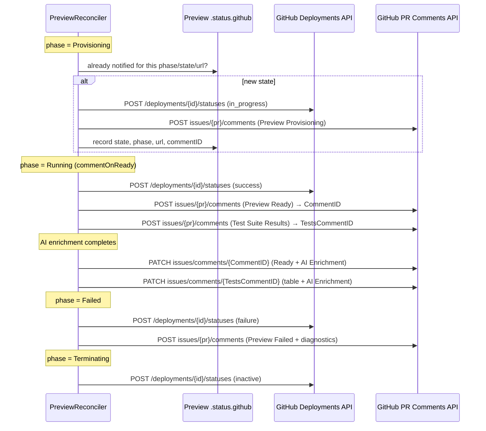

# GitHub Integration

> The controller mirrors a preview environment's lifecycle into a GitHub Deployment and keeps a small set of de-duplicated pull request comments up to date.

## Introduction

When `spec.github.enabled` is set, the operator reports preview state back to GitHub as it reconciles a `Preview` CR. It drives the GitHub Deployment status through the environment phases and maintains in-place pull request comments — a "Preview Ready"/"Preview Failed" summary and a test-suite results table — so reviewers see live status without leaving the PR. The operator never watches GitHub; it only pushes updates outward via the REST API.

## What it's for

A reviewer looking at a pull request should be able to tell, without context-switching, whether the preview is provisioning, ready, or broken — and where it lives. This feature closes that loop by turning the operator's observed status into GitHub Deployment states and PR comments, instead of forcing reviewers to run `kubectl` against the cluster.

## What it does

- Updates the GitHub Deployment status as the phase changes: `Provisioning` → `in_progress`, `Running` → `success`, `Failed` → `failure`, `Terminating` → `inactive`, `Pending` → `queued`.
- Posts a "Preview Provisioning" comment while building and a "Preview Failed" comment (with diagnostics, logs, recommendations) on failure.
- Posts a "Preview Ready" comment when the preview becomes `Running` (only if `commentOnReady` is true), including the environment URL, namespace, expiry, evidence, and an AI-Assisted Summary.
- Posts a separate "Test Suite Results" comment with a per-suite table (Smoke, Migration, Contract, Regression, E2E), collapsible logs, kagent strategy/analysis, and an AI Enrichment section.
- De-duplicates work: it stores the last Deployment state, phase, URL, and comment IDs in `status.github`, skips redundant API calls, and PATCHes existing comments in place rather than creating new ones.
- Labels statuses in the AI Enrichment section via `statusIcon`: `SUCCESS`, `FAIL`, `RUN`, or `SKIP`.
- Fetches the raw PR diff (used by AI enrichment) from the GitHub API.

## How it works



After each status write, `syncGitHubAfterStatus` maps the current phase to a Deployment state and calls `syncGitHub`, which first checks `githubAlreadyNotified` (comparing `DeploymentState`, `LastNotifiedPhase`, `LastEnvironmentURL`, and whether a ready comment already exists) before touching the API. The "Preview Ready" and "Test Suite Results" comments are created once; their IDs (`CommentID`, `TestsCommentID`) are saved in status, and later updates — including AI enrichment outcomes — PATCH those same comments so the PR always carries exactly one of each. All calls use the REST API with `Authorization: Bearer <token>` and `X-GitHub-Api-Version: 2022-11-28`.

## Relationships with other components

- [Test Suites](./test-suites.md) — the test-suite results table and collapsible per-suite logs are rendered into a PR comment by this feature.
- [AI Enrichment](./ai-enrichment.md) — produces the AI Enrichment section and consumes the fetched PR diff; its completion triggers in-place comment updates.
- [AI Failure Analysis](./ai-failure-analysis.md) — kagent analysis is embedded into the test-results comment (and a dedicated AI Failure Analysis comment) using the same comment-update mechanism.
- [Lifecycle & Provisioning](./lifecycle.md) — phase transitions are what drive every Deployment status and comment emitted here.

## Configuration

`spec.github.*` fields:

| Field | Type | Default | Notes |
|-------|------|---------|-------|
| `enabled` | bool | `false` | Master switch for all GitHub updates. |
| `owner` | string | — | Repository owner/organization. Required when enabled. |
| `repo` | string | — | Repository name. Required when enabled. |
| `deploymentId` | int64 | `0` | GitHub Deployment id to update. Required (> 0) when enabled. |
| `environment` | string | `pr-<prNumber>` | Deployment environment name; falls back to `pr-<prNumber>`. |
| `tokenSecretRef` | object | — | Secret holding the GitHub token. Required when enabled. |
| `commentOnReady` | bool | `false` | When true, posts the "Preview Ready" comment once the preview is `Running`. |

The admission webhook rejects `spec.github.enabled: true` if any of `owner`, `repo`, `deploymentId` (> 0), or `tokenSecretRef.name` is missing.

Token Secret (`spec.github.tokenSecretRef`):

| Field | Default | Notes |
|-------|---------|-------|
| `name` | — | Secret name (required). |
| `namespace` | operator namespace | Where the Secret is looked up when unset. |
| `key` | `token` | Data key holding the token value. |

> Note: when `namespace` is empty the token is read from the operator namespace. There is a known leftover bug where the in-code default namespace constant is stale, so always set `tokenSecretRef.namespace` explicitly (or deploy the Secret in the operator namespace) to avoid surprises.

Create the Secret:

```bash
kubectl create secret generic preview-github-token \
  --namespace preview-operator-system \
  --from-literal=token="<GITHUB_PAT>"
```

Minimal CR snippet:

```yaml
apiVersion: platform.example.com/v1alpha1
kind: Preview
spec:
  prNumber: 42
  github:
    enabled: true
    owner: my-org
    repo: my-app
    deploymentId: 123456789
    environment: pr-42
    commentOnReady: true
    tokenSecretRef:
      name: preview-github-token
      namespace: preview-operator-system
      key: token
```

The current auth model uses a long-lived Personal Access Token (PAT) for demo simplicity. A GitHub App migration path (short-lived, auto-rotated installation tokens) is documented in [SECURITY.md](https://github.com/ihsenalaya/preview-operator/blob/main/SECURITY.md#pat-current-demo-mode-vs-github-app-production-target).

## Reference

- [`internal/controller/github.go`](https://github.com/ihsenalaya/preview-operator/blob/main/internal/controller/github.go) — Deployment status, comment building, de-duplication, `statusIcon` labels, comment PATCH/update logic.
- [`internal/controller/ai_enrichment.go`](https://github.com/ihsenalaya/preview-operator/blob/main/internal/controller/ai_enrichment.go) — `fetchPRDiff` (raw diff via `Accept: application/vnd.github.diff`).
- [`api/v1alpha1/preview_types.go`](https://github.com/ihsenalaya/preview-operator/blob/main/api/v1alpha1/preview_types.go) — `GitHubIntegrationSpec`, `GitHubTokenSecretRef`, `GitHubIntegrationStatus`.
- [SECURITY.md](https://github.com/ihsenalaya/preview-operator/blob/main/SECURITY.md) — threat model, RBAC, and the PAT → GitHub App migration path.
