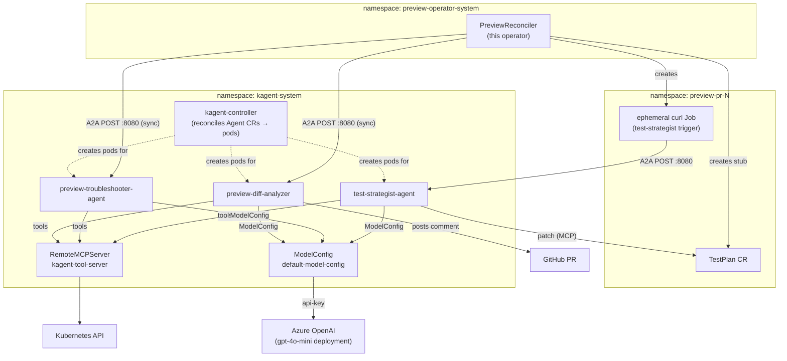
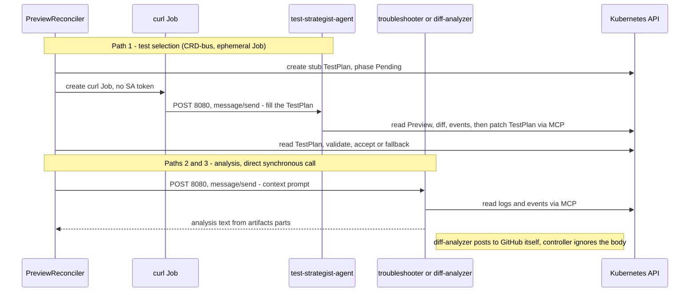
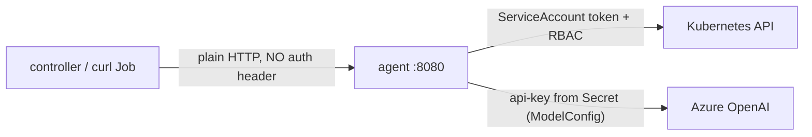

# kagent — Architecture & Internals (deep dive)

> Everything about how this operator uses kagent: how agents are created, how the controller talks to them, how they authenticate, how they reach Azure OpenAI, and what each agent does.

## Introduction
[kagent](https://kagent.dev) is an external platform that runs LLM **agents** as
Kubernetes workloads. This operator does not embed an LLM SDK for agent work;
instead it **delegates** three jobs to kagent agents — diff analysis, test
selection, and failure analysis — and talks to them over the A2A (Agent‑to‑Agent)
JSON‑RPC protocol. This guide is the end‑to‑end map: components, the four agents,
the wire protocol, authentication, and the Azure OpenAI wiring.

> This is the *internals* guide. For the feature‑level views see
> [AI Test Strategist](./ai-test-strategist.md), [AI Failure Analysis](./ai-failure-analysis.md),
> [MCP Servers & Agent Tools](./mcp-servers.md), and [Customizing AI Prompts](./ai-prompts.md).

## The big picture



Three namespaces are involved: the **operator** triggers agents; the **preview**
namespace hosts the ephemeral trigger Job and the `TestPlan`; the **kagent‑system**
namespace runs the kagent controller, the agents, the shared `ModelConfig`, and the
tool server. All agents reach Azure OpenAI through the same `ModelConfig`.

## Components — who ships what
kagent spans three repos/installs. Being explicit avoids confusion:

| Component | Where it comes from | Notes |
|-----------|---------------------|-------|
| kagent controller, runtime (ADK), `kagent-tool-server`, `ModelConfig` CRD | **kagent platform** (Helm install, pinned `0.9.2`) | Not in this repo |
| `test-strategist-agent`, `failure-analyst-agent` Agent CRs | **this repo** (`k8s/kagent/agents/`) | `failure-analyst-agent` is legacy/dormant — see [Gotchas](#gotchas) |
| Scoped `MCPServer` policy CRs (`kube-read-mcp`, `kube-write-testplan-mcp`) | **this repo** (`k8s/kagent/mcp-servers/`) | See [MCP Servers](./mcp-servers.md) |
| Agent RBAC (SA `kagent-test-strategist` + ClusterRole) | **this repo** (`config/rbac/agent_*.yaml`) | Read CRs + write TestPlans |
| `preview-troubleshooter-agent`, `preview-diff-analyzer` Agent CRs + read‑only RBAC (SA `kagent-troubleshooter`) | **app repo** (`idp-preview`) | The agents the controller actually calls for analysis |
| Custom RemoteMCPServers `jaeger-mcp-server` (traces) and `github-mcp-server` (PR ops) | **app repo** (`idp-preview`) | Built + deployed by the app repo; see [MCP Servers](./mcp-servers.md) |
| Azure OpenAI key, GitHub token | **provided at install** | Never stored in any repo |

## The four agents
The controller knows four agent **names** (defaults in `KagentIntegrationSpec`,
all overridable via `spec.kagent.*`). Three are live; one is dormant.

### 1. `test-strategist-agent` — picks which test suites to run
- **CR:** in this repo — [`k8s/kagent/agents/test-strategist-agent.yaml`](https://github.com/ihsenalaya/preview-operator/blob/main/k8s/kagent/agents/test-strategist-agent.yaml). Default name `spec.kagent.testStrategistAgentName`.
- **Trigger:** a `TestPlan` in `status.phase=Pending` (created when `spec.testStrategy.mode: Auto`). Reached via an **ephemeral curl Job** (CRD‑bus pattern), not a direct controller call.
- **System prompt (rules):** smoke is always `mustRun` (unless a pure‑docs PR with confidence ≥ 95); `migration` if migration files changed; `contract` if `openapi.yaml` or new/removed routes appear in the diff; `e2e` if frontend/templates changed; `regression` by default; **never** put a suite in both `mustRun` and `canSkip`; nudge `confidence` up/down based on `ReconcileEvents` history.
- **Per‑call context** (from `testplan_strategy.go`): "fill TestPlan *X*; read the Preview's `changeContext.changedFiles` / `detectedImpacts` / `confidenceThreshold`; the raw diff is in ConfigMap `diffPatchRef` (key `diff.patch`); read the last 20 `ReconcileEvents`; decide `mustRun`/`canSkip`/`confidence`/`rationale`; patch the TestPlan (`generatedBy=Agent`) and set `status.phase=Ready`."
- **Tools:** `k8s_get_resources`, `k8s_describe_resource`, `k8s_get_resource_yaml`, **`k8s_apply_manifest`, `k8s_patch_resource`** (the only agent with write access — to TestPlans only).
- **Output:** patches the `TestPlan` spec; the controller then **validates** it (confidence ≥ threshold, `mustRun ∩ canSkip = ∅`) and accepts it or falls back to FullSuite. Full contract: [../agent-contract.md](https://github.com/ihsenalaya/preview-operator/blob/main/docs/agent-contract.md).

### 2. `preview-troubleshooter-agent` — explains a failed preview
- **CR:** **external** (app repo). Default name `spec.kagent.agentName` = `preview-troubleshooter-agent`.
- **Trigger:** `status.tests.phase=Failed`. Reached by a **direct, synchronous** A2A call from the controller (`callKagentAgent`).
- **Per‑call context** (`buildAnalysisPrompt`): preview name, PR #, branch, namespace, repo; the test‑strategist's `rationale`/`confidence`/`mustRun`/`canSkip`; and per‑suite results (smoke/migration/contract/regression/e2e) with pass/fail counts and up to 10 output lines each.
- **Tools (read‑only, two MCP servers):** from `kagent-tool-server` — `k8s_get_pod_logs`, `k8s_get_resources`, `k8s_get_events`, `k8s_describe_resource`, `k8s_get_resource_yaml`, `k8s_get_available_api_resources`; **and from `jaeger-mcp-server`** — `jaeger_get_services`, `jaeger_get_traces`, `jaeger_get_trace`. So it correlates Kubernetes state **and distributed traces** (service name format `idp-preview-pr-<N>`). Never reads Secrets, never writes. See [Observability](./observability.md).
- **Output:** returns **markdown text**; the controller stores it in `status.kagent.analysis` and folds it into the existing test‑results PR comment.

### 3. `preview-diff-analyzer` — comments on the PR diff
- **CR:** **external** (app repo). Default name `spec.kagent.diffAnalyzerAgentName` = `preview-diff-analyzer`.
- **Trigger:** the preview reaching `phase=Running` (requires `spec.github` set). Direct synchronous A2A call.
- **Per‑call context:** minimal — *"Analyze the diff for PR #N in repo owner/repo and post a structured analysis comment on the PR."*
- **Tools (`github-mcp-server` only, no cluster access):** `gh_get_pr_info`, `gh_get_pr_files`, `gh_post_pr_comment`, `gh_update_pr_comment`, `gh_find_pr_comment` — it reads the changed files from GitHub, classifies their impact, and posts a `changeContext` summary comment.
- **Output:** the agent posts its comment **directly to GitHub** via the GitHub MCP server. The controller does **not** read the response body — it marks `status.diffAnalysis.phase = Succeeded` on any non‑error HTTP reply (fire‑and‑forget).

### 4. `failure-analyst-agent` — **dormant / legacy**
- **CR:** in this repo — [`k8s/kagent/agents/failure-analyst-agent.yaml`](https://github.com/ihsenalaya/preview-operator/blob/main/k8s/kagent/agents/failure-analyst-agent.yaml), well‑formed, read‑only tools, a good failure‑analysis prompt.
- **Status:** **not called by the controller.** An earlier design hard‑coded a `failure-analyst-agent` URL that "is not deployed"; the controller was refactored to call `preview-troubleshooter-agent` instead (see the comment at `internal/controller/kagent.go` `callKagentAgent`). The CR remains as a reference template. To use it, set `spec.kagent.agentName: failure-analyst-agent` **and** deploy it.

## How the controller talks to agents — the three trigger paths



| Path | When | How it's reached | Sync? | Result lands in |
|------|------|------------------|-------|-----------------|
| diff‑analyzer | preview → `Running` | direct A2A POST | sync (3‑min timeout), body ignored | `status.diffAnalysis.phase` |
| test‑strategist | `TestPlan` Pending (`mode: Auto`) | ephemeral `curlimages/curl:8.7.1` Job | agent fills the CR; controller polls | `TestPlan` spec → `status.testPlanRef` |
| troubleshooter | `status.tests.phase=Failed` | direct A2A POST | sync (3‑min timeout), body parsed | `status.kagent.analysis` + PR comment |

**Guards & cooldowns:** analysis paths skip when already `Succeeded` or `Running`, and back off 5 minutes after a `Failed` attempt. The test‑strategist path has an `agentTimeoutSeconds` (default 60) after which the controller applies its fallback policy (`Full`/`Skip`/`Error`).

## The A2A protocol on the wire
All three paths speak the same thing — JSON‑RPC 2.0, method `message/send`, HTTP
`POST` to `http://<agent-name>.<namespace>.svc.cluster.local:8080` (port **8080**,
root path). Request body:

```json
{
  "jsonrpc": "2.0",
  "method": "message/send",
  "id": "<uuid>",
  "params": {
    "message": {
      "role": "user",
      "messageId": "<uuid>",
      "parts": [{ "type": "text", "text": "<the per-call prompt>" }]
    }
  }
}
```

The troubleshooter response is parsed for text: the controller collects
`result.artifacts[].parts[]` where `kind == "text"`, falling back to
`result.status.message.parts[]`, and joins them. A `result.status.state == "failed"`
or a JSON‑RPC `error` marks the kagent phase `Failed`.

## Authentication — three independent hops
There is no single credential; each hop authenticates separately.



1. **Controller → agent:** plain in‑cluster HTTP with only `Content-Type: application/json` — **no Authorization header, no token**. The trust boundary is the cluster network (and NetworkPolicy), not request auth. The test‑strategist's curl Job even sets `automountServiceAccountToken: false` — it is a dumb trigger carrying no credentials.
2. **Agent → Kubernetes API:** the *agent pod* (not the trigger Job) acts under a ServiceAccount. The test‑strategist uses [`kagent-test-strategist`](https://github.com/ihsenalaya/preview-operator/blob/main/config/rbac/agent_rolebinding.yaml) (read `previews`/`testplans`/`reconcileevents`, write `testplans` only); the read‑only analysis agents use a read‑only SA shipped from the app repo. RBAC is the real boundary — see [Security & Isolation](./security.md).
3. **Agent → Azure OpenAI:** the agent reads the `ModelConfig` and its referenced Secret, then calls Azure with an `api-key` header. Details below.

## How agents are created (Agent CR → running pod)
You don't deploy agent pods yourself. Each agent is an `Agent` CR
(`kagent.dev/v1alpha2`, `type: Declarative`) carrying a `modelConfig` reference, a
`systemMessage`, and a `tools` list. The **kagent controller** watches these CRs and
reconciles each into a running pod (the ADK runtime) that loads the system prompt,
mounts the referenced MCP tool servers, and listens for A2A calls on `:8080`.

```bash
# "Creating an agent" = applying its CR; the kagent controller does the rest.
kubectl apply -f k8s/kagent/agents/test-strategist-agent.yaml
```

## Azure OpenAI configuration
All agents share one `ModelConfig` named `default-model-config` in `kagent-system`
(pre‑created by the kagent Helm chart, then patched at install):

```bash
kubectl patch modelconfig default-model-config -n kagent-system --type=merge -p '{
  "spec": {
    "provider": "AzureOpenAI",
    "model": "gpt-4o-mini",
    "apiKeySecret": "kagent-openai",
    "apiKeySecretKey": "OPENAI_API_KEY",
    "azureOpenAI": {
      "azureEndpoint": "https://preview-openai-<ID>.openai.azure.com",
      "azureDeployment": "gpt-4o-mini",
      "apiVersion": "2024-10-21"
    }
  }
}'
```

The key lives in Secret `kagent-openai` (key `OPENAI_API_KEY`) in `kagent-system`:

```bash
kubectl create secret generic kagent-openai -n kagent-system \
  --from-literal=OPENAI_API_KEY="$AOAI_KEY"
```

> **kagent's key ≠ the operator's key.** The operator's own [AI Enrichment](./ai-enrichment.md)
> uses a *separate* Secret `azure-openai-credentials` (key `api-key`) in
> `preview-operator-system`. They often hold the same Azure key but are wired
> independently — kagent agents never use the operator's secret and vice‑versa.

## Installation (summary)
Pinned to **kagent 0.9.2** in `kagent-system`:

```bash
helm install kagent-crds oci://ghcr.io/kagent-dev/kagent/helm/kagent-crds --version 0.9.2 -n kagent-system --create-namespace
helm install kagent      oci://ghcr.io/kagent-dev/kagent/helm/kagent      --version 0.9.2 -n kagent-system
# then: create kagent-openai secret, patch default-model-config, apply the Agent CRs + RBAC
```

Full steps (including the app‑repo agents and read‑only RBAC) are in the README
Installation section. Enable per preview with `spec.kagent.enabled: true`.

## Gotchas
- **Pin 0.9.2.** 0.9.4 regressed A2A session handling (session stored as `admin@kagent.dev`, looked up as `A2A_USER_<ctx>`) → `SessionNotFoundError` on every run.
- **`failure-analyst-agent` is dormant.** It's in‑repo but the controller calls `preview-troubleshooter-agent` (external). Deploy + point `spec.kagent.agentName` at it to use it.
- **Default agent names assume the app‑repo agents exist.** `agentName` and `diffAnalyzerAgentName` default to agents *not* in this repo; if they aren't deployed, the A2A call fails (DNS/connection) and the phase stays `Failed`.
- **No request auth on the controller→agent hop.** Anyone able to reach `:8080` in‑cluster can invoke an agent; rely on NetworkPolicy.
- **diff‑analyzer is fire‑and‑forget.** The controller marks it `Succeeded` on any non‑error reply without reading the analysis — the content only exists on the PR.
- **Everything lives in `kagent-system`** by default; the `ModelConfig` must exist before agents can serve (a missing/partly‑patched `ModelConfig` = agents with no LLM).

## Relationships with other components
- [AI Test Strategist](./ai-test-strategist.md) / [AI Failure Analysis](./ai-failure-analysis.md) — the feature‑level guides for two of these agents.
- [MCP Servers & Agent Tools](./mcp-servers.md) — what the agents are allowed to call.
- [Customizing AI Prompts](./ai-prompts.md) — editing each agent's `systemMessage`.
- [Security & Isolation](./security.md) and [../rbac-design.md](https://github.com/ihsenalaya/preview-operator/blob/main/docs/rbac-design.md) — the RBAC + validation that bound a compromised agent.
- [GitHub Integration](./github-integration.md) — where troubleshooter/diff‑analyzer output is delivered.

## Reference
- Controller integration: [`../../internal/controller/kagent.go`](https://github.com/ihsenalaya/preview-operator/blob/main/internal/controller/kagent.go) (URL builders, `triggerKagentDiffAnalysis`, `triggerKagentAnalysis`, `callKagentAgent`, `buildAnalysisPrompt`, A2A structs) and [`../../internal/controller/testplan_strategy.go`](https://github.com/ihsenalaya/preview-operator/blob/main/internal/controller/testplan_strategy.go) (`createTestStrategistTriggerJob`)
- Spec/status: [`../../api/v1alpha1/preview_types.go`](https://github.com/ihsenalaya/preview-operator/blob/main/api/v1alpha1/preview_types.go) — `KagentIntegrationSpec`, `KagentStatus`
- Agent CRs: [`../../k8s/kagent/agents/`](https://github.com/ihsenalaya/preview-operator/blob/main/k8s/kagent/agents/) · MCP policy: [`../../k8s/kagent/mcp-servers/`](https://github.com/ihsenalaya/preview-operator/blob/main/k8s/kagent/mcp-servers/) · RBAC: [`../../config/rbac/agent_role.yaml`](https://github.com/ihsenalaya/preview-operator/blob/main/config/rbac/agent_role.yaml)
- Install, ModelConfig patch, 0.9.2 pin: [`../../README.md`](https://github.com/ihsenalaya/preview-operator/blob/main/README.md) · troubleshooting: [../troubleshooting-kagent.md](https://github.com/ihsenalaya/preview-operator/blob/main/docs/troubleshooting-kagent.md)
