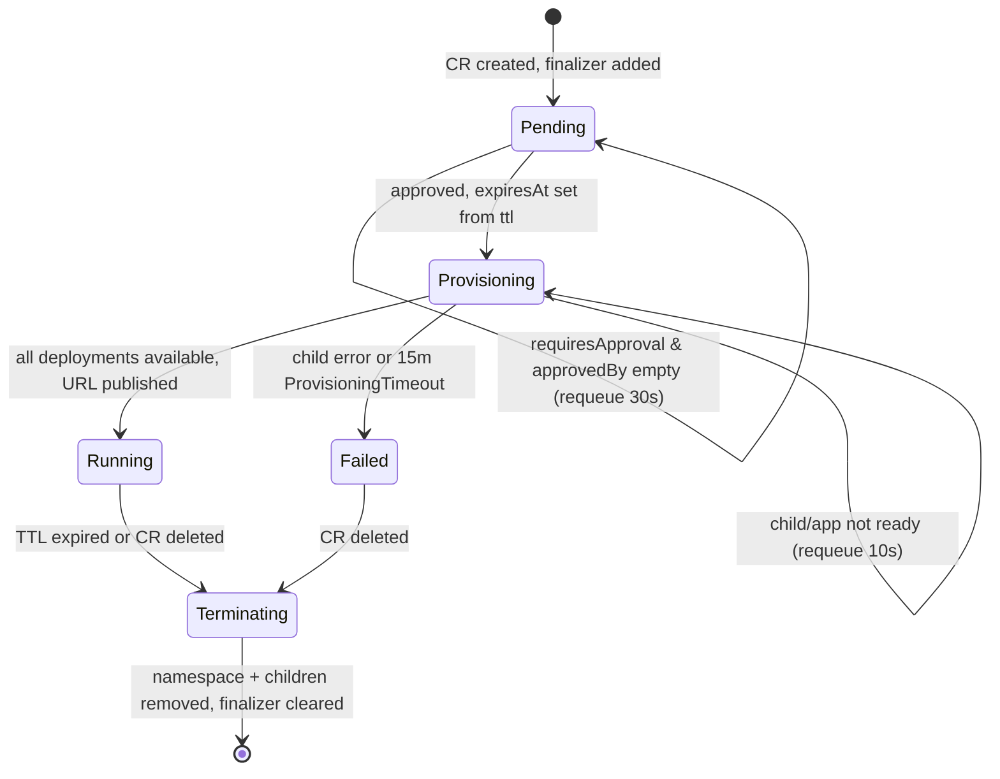

# Preview Lifecycle & Provisioning

> The core reconcile loop that turns a single `Preview` CR into an isolated, quota-bounded, auto-expiring environment.

## Introduction
The Preview lifecycle is the operator's central control loop. For every `Preview` custom resource it provisions one dedicated namespace and a full set of child resources (quota, network policy, deployments, services, ingress/VirtualService), then drives the resource through a phase state machine until it is `Running`. The same loop tears everything down when the TTL expires or the CR is deleted.

## What it's for
Per-PR preview environments must be cheap, isolated, and self-cleaning. Without an operator each PR would need hand-rolled namespaces, quotas, and cleanup cron jobs. This feature solves that by making one `Preview` CR the single source of truth: it guarantees one isolated namespace per PR, bounds resource usage by tier, optionally gates provisioning on human approval, and auto-deletes the environment after its TTL so stale previews never accumulate.

## What it does
The operator, on each reconcile, performs these actions in order:
- Adds a finalizer (`platform.company.io/finalizer`) so deletion can clean up child resources.
- Resets derived test/AI status and deletes stale Jobs when `spec` changes (Generation > `status.observedGeneration`).
- Deletes the CR if the TTL has expired (`status.expiresAt` in the past).
- Blocks in `Pending` and requeues every 30s while `spec.requiresApproval` is true and `spec.approvedBy` is empty (approval gate).
- Sets `status.expiresAt` from `spec.ttl` on first provision and moves the phase to `Provisioning`.
- Fails the Preview if it stays in `Provisioning` longer than 15 minutes past its creation time (`ProvisioningTimeout` backstop).
- Reconciles the namespace, `preview-quota` ResourceQuota (sized per tier), and a NetworkPolicy.
- Reconciles either one `app` Deployment from `spec.image`, or one `svc-<name>` Deployment per entry in `spec.services[]` (multi-service mode; `spec.image` is ignored).
- Reconciles the ClusterIP Service(s) and the path-based Ingress (or Istio VirtualService when Istio is detected).
- Waits for the app Deployment(s) to report available replicas, then marks the phase `Running` and publishes the URL.

## How it works



Reconcile is idempotent: every child resource is created via `CreateOrUpdate` and owned by the `Preview` via a controller reference, so repeated loops converge on the same state and a failed step simply requeues. A spec change bumps the CR `Generation`; `resetDerivedStateForNewGeneration` detects `Generation != observedGeneration`, deletes stale test/AI Jobs and ConfigMaps, clears the related status, and re-syncs `observedGeneration`. The phase is `Provisioning` until the watched Deployments report `availableReplicas >= replicas`; if that never happens, the deadline backstop fails the Preview so a diagnostics/FailureReport is captured instead of looping forever.

## Relationships with other components
- The namespace, quota, and Pod Security labels established here are the substrate for every other feature; see [Security](./security.md).
- When `spec.database.enabled` is true, the loop waits on PostgreSQL readiness before deploying the app — see [Ephemeral PostgreSQL](./ephemeral-postgres.md).
- Once `Running`, the loop hands off to post-deploy stages: AI enrichment, the test suite, and kagent analysis (see sibling guides), and emits GitHub Deployment/PR updates.
- Exposure is delegated to an Nginx Ingress or an Istio VirtualService depending on cluster auto-detection.

## Configuration
| Field | Type | Default | Purpose |
|-------|------|---------|---------|
| `spec.image` | string | (required if no `services`) | Single-service container image |
| `spec.services[]` | list | — | Multi-service mode: `name`, `image`, `port` (80), `pathPrefix`, `replicas`, `env` |
| `spec.resourceTier` | enum `small`/`medium`/`large` | `medium` | CPU/Mem quota tier (small 250m/256Mi, medium 500m/512Mi, large 2000m/2Gi limits) |
| `spec.replicas` | int (1–5) | `1` | Pod replicas for the app/services |
| `spec.requiresApproval` | bool | `false` | Gate provisioning until `approvedBy` is set |
| `spec.approvedBy` | string | — | User granting approval |
| `spec.ttl` | string `^[0-9]+(h\|m)$` | `48h` | Time-to-live before auto-deletion |

```yaml
apiVersion: platform.company.io/v1alpha1
kind: Preview
metadata:
  name: pr-42
spec:
  branch: feat/new-checkout
  prNumber: 42
  image: ghcr.io/acme/app:pr-42
  resourceTier: medium
  replicas: 1
  ttl: 48h
  requiresApproval: false
```

Note: provisioning the `large` tier forces `requiresApproval: true` via the admission webhook (it cannot be bypassed). The dedicated namespace is always `preview-pr-<prNumber>`.

## Reference
- `../../api/v1alpha1/preview_types.go` — `PreviewSpec`, `PreviewStatus`, phase constants, tier limits, defaults
- `../../internal/controller/preview_controller.go` — `Reconcile`, `reconcileProvisioning`, generation reset, `provisioningDeadline`
- `../../internal/controller/exposure.go` — namespace exposure via Ingress / Istio VirtualService
- [Ephemeral PostgreSQL](./ephemeral-postgres.md), [Security](./security.md) — related feature guides
- README "## 4. Controller Deep Dive" — canonical full reconcile sequence
