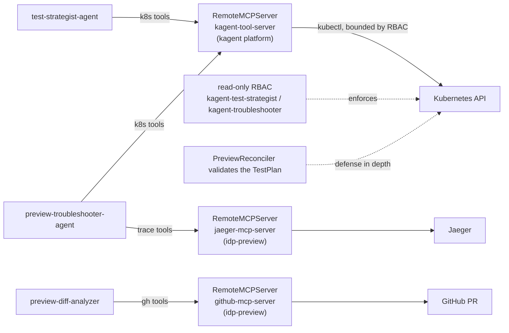

# MCP Servers & Agent Tools

> How the kagent agents read and write the cluster — the MCP tool servers they use, what each agent is granted, and how to extend it.

## Introduction
The operator's AI agents don't talk to the Kubernetes API directly — they call
**tools** exposed over the Model Context Protocol (MCP). An MCP "tool server"
publishes named tools (e.g. `k8s_get_pod_logs`); an Agent CR lists the exact tool
names it may call. This guide covers the MCP servers shipped in this repo, the
platform server the agents actually call, and how to grant an agent more.

## What it's for
Agents need *scoped, auditable* access to data: the test‑strategist must read the
diff and write a `TestPlan`; the troubleshooter must read logs, events, **and
distributed traces** but never secrets; the diff‑analyzer must read and comment on
a GitHub PR. MCP makes each grant explicit and per‑tool, so a compromised or
hallucinating agent can only do what its tool list — and the underlying RBAC —
allow. See [Security & Isolation](./security.md) for the blast‑radius argument.

## What it does
- Wires each Agent CR to one or more tool servers via `spec.declarative.tools[].mcpServer`, each with an explicit `toolNames` allow‑list.
- Uses **three** RemoteMCPServers across the agents: `kagent-tool-server` (Kubernetes), `jaeger-mcp-server` (traces), and `github-mcp-server` (PR operations).
- Backs the Kubernetes access with a bounded ServiceAccount + ClusterRole, plus controller‑side validation of anything an agent writes.

## How it works



An agent's model decides to call a tool by name; the MCP server executes it (a
bounded `kubectl`‑style call for Kubernetes, or an HTTP call to Jaeger/GitHub). For
the Kubernetes path, two independent limits apply: the agent's **ServiceAccount
RBAC** (what the API server will allow) and, for writes, the **controller's
validation** of the resulting `TestPlan` (see [AI Test Strategist](./ai-test-strategist.md)).
The tool allow‑list in the Agent CR is the narrowest grant.

## Who ships what — three sources
Being explicit here matters — the MCP stack spans three places.

**In the operator repo** (`k8s/kagent/`):
- Two scoped policy CRs (`kind: MCPServer`, `kagent.dev/v1alpha1`):
  - [`kube-read-mcp.yaml`](https://github.com/ihsenalaya/preview-operator/blob/main/k8s/kagent/mcp-servers/kube-read-mcp.yaml) — read‑only `get/list/watch` on `previews`, `testplans`, `reconcileevents` (group `platform.company.io`), stdio transport `kubectl get`.
  - [`kube-write-testplan-mcp.yaml`](https://github.com/ihsenalaya/preview-operator/blob/main/k8s/kagent/mcp-servers/kube-write-testplan-mcp.yaml) — `create/update/patch` on `testplans` and `testplans/status` **only**, stdio transport `kubectl apply`.
- Two Agent CRs: [`test-strategist-agent.yaml`](https://github.com/ihsenalaya/preview-operator/blob/main/k8s/kagent/agents/test-strategist-agent.yaml) (live) and [`failure-analyst-agent.yaml`](https://github.com/ihsenalaya/preview-operator/blob/main/k8s/kagent/agents/failure-analyst-agent.yaml) (a dormant template — the controller calls the app‑repo `preview-troubleshooter-agent` instead; see [kagent Architecture](./kagent-architecture.md)).
- The test‑strategist RBAC: [`config/rbac/agent_role.yaml`](https://github.com/ihsenalaya/preview-operator/blob/main/config/rbac/agent_role.yaml), [`agent_rolebinding.yaml`](https://github.com/ihsenalaya/preview-operator/blob/main/config/rbac/agent_rolebinding.yaml) (ServiceAccount `kagent-test-strategist`).

**In the app repo** (`idp-preview/k8s/kagent/`):
- The agents the controller actually calls for analysis: `preview-troubleshooter-agent` and `preview-diff-analyzer` (with their `systemMessage` prompts).
- Two **custom** RemoteMCPServers it builds and deploys: `jaeger-mcp-server` (Jaeger trace tools, served at `:8811/sse`) and `github-mcp-server` (PR tools, uses the `preview-github-token` Secret).
- The read‑only RBAC for the analysis agents: ServiceAccount `kagent-troubleshooter` + ClusterRole `kagent-troubleshooter-readonly`.

**Provided by the kagent platform** (installed at README Installation → "Install kagent"):
- The `RemoteMCPServer` named **`kagent-tool-server`** and the implementations of the `k8s_*` tools.
- The kagent controller/runtime and the `ModelConfig` CRD.

> The Kubernetes tools come from the platform's `kagent-tool-server`; the trace and
> GitHub tools come from custom MCP servers shipped by the app repo. The durable
> Kubernetes security boundary is still RBAC + controller validation.

## Which tools each agent gets
The allow‑list is `spec.declarative.tools[].mcpServer.toolNames` in each Agent CR:

| Agent | MCP server | toolNames | Effect |
|-------|-----------|-----------|--------|
| test‑strategist | `kagent-tool-server` | `k8s_get_resources`, `k8s_describe_resource`, `k8s_get_resource_yaml`, `k8s_apply_manifest`, `k8s_patch_resource` | read context + **write the TestPlan** |
| preview‑troubleshooter | `kagent-tool-server` | `k8s_get_pod_logs`, `k8s_get_resources`, `k8s_get_events`, `k8s_describe_resource`, `k8s_get_resource_yaml`, `k8s_get_available_api_resources` | read‑only K8s diagnosis (no write, no secrets) |
| preview‑troubleshooter | `jaeger-mcp-server` | `jaeger_get_services`, `jaeger_get_traces`, `jaeger_get_trace` | read distributed traces to find failing requests |
| preview‑diff‑analyzer | `github-mcp-server` | `gh_get_pr_info`, `gh_get_pr_files`, `gh_post_pr_comment`, `gh_update_pr_comment`, `gh_find_pr_comment` | read the PR diff and post/update a comment (no cluster access) |

## Required vs. optional MCP servers
Only one MCP server is load‑bearing; the rest enrich specific agents.

| MCP server | Status | Required for | If absent |
|------------|--------|--------------|-----------|
| `kagent-tool-server` | **Required** | the test‑strategist (it `k8s_apply_manifest`s the `TestPlan`) and the troubleshooter (it reads logs/events) | AI test selection can't write a plan and failure analysis has no cluster data — the kagent agents are effectively non‑functional |
| `jaeger-mcp-server` | **Optional** | trace‑aware failure analysis (the troubleshooter's Jaeger tools) | the troubleshooter still diagnoses from logs/events; it just can't cite traces. Needs [Observability](./observability.md) (OTel + Jaeger) installed |
| `github-mcp-server` | **Optional** | the diff‑analyzer agent (reads the PR diff and posts the `changeContext` comment) | don't run the diff‑analyzer; nothing else depends on it |

> Whether a server is "required" follows from which agents you enable. If you only
> use AI failure analysis, you need `kagent-tool-server` (and optionally
> `jaeger-mcp-server`); if you don't run the diff‑analyzer, `github-mcp-server` is
> unnecessary.

## Adding MCP servers is config‑only — no operator change
**Adding a new MCP server (or granting an agent more tools) never requires changing
the operator's Go code, rebuilding its image, or upgrading its Helm release.** The
operator has zero references to MCP servers or tool names — it only triggers agents
by *name* over A2A. Tools live entirely in Kubernetes manifests that the kagent
platform reconciles. (The one exception is adding a brand‑new agent that the
*operator itself* must trigger — a new A2A call path in
[`internal/controller/kagent.go`](https://github.com/ihsenalaya/preview-operator/blob/main/internal/controller/kagent.go); see
[kagent Architecture](./kagent-architecture.md). Giving an existing agent more
tools is never a code change.)

### Grant an agent a tool the server already exposes
1. Add the tool name to the agent's `toolNames` list and `kubectl apply` the Agent CR:
   ```yaml
   # k8s/kagent/agents/failure-analyst-agent.yaml
   tools:
   - type: McpServer
     mcpServer:
       apiGroup: kagent.dev
       kind: RemoteMCPServer
       name: kagent-tool-server
       toolNames:
         - k8s_get_pod_logs
         - k8s_get_events
         - k8s_get_resources
         - k8s_describe_resource
         - k8s_get_resource_yaml
         - <new_tool_name>          # ← add a tool the server already exposes
   ```
2. The tool **must already be provided** by `kagent-tool-server` — you can only
   allow‑list tools the platform server exposes.
3. If the new tool writes or reads something new, widen the agent's RBAC in
   `config/rbac/agent_role.yaml` accordingly — otherwise the call is denied at the
   API server even though the tool is allow‑listed.
4. Update the agent's `systemMessage` so it knows when to use the tool (see
   [Customizing AI Prompts](./ai-prompts.md)).

### Add a brand‑new MCP server (example: Prometheus)
Say you want the troubleshooter to correlate failures with **metrics**. You add a
Prometheus MCP server and grant it — no operator change. This mirrors exactly how
`jaeger-mcp-server` was added in the app repo. *(The names below are illustrative —
pick an MCP server image that speaks to your Prometheus.)*

1. **Deploy the MCP server** as a `RemoteMCPServer` (plus its Deployment/Service if
   it's a self‑hosted server), pointed at your Prometheus. A complete, deployable
   manifest is in [`docs/examples/prometheus-mcp-server.yaml`](../examples/prometheus-mcp-server.yaml);
   the `RemoteMCPServer` itself is just:
   ```yaml
   apiVersion: kagent.dev/v1alpha2
   kind: RemoteMCPServer
   metadata:
     name: prometheus-mcp-server
     namespace: kagent-system
   spec:
     description: "Prometheus metrics MCP server for kagent failure analysis."
     url: "http://prometheus-mcp-server.kagent-system.svc.cluster.local:8811/sse"
     protocol: SSE
   ```
2. **Grant it to an agent** — add another entry under the agent's `tools` with the
   server name and the tools it exposes:
   ```yaml
   # idp-preview/k8s/kagent/preview-troubleshooter-agent.yaml
   tools:
   - type: McpServer
     mcpServer: { apiGroup: kagent.dev, kind: RemoteMCPServer, name: kagent-tool-server, toolNames: [ ... ] }
   - type: McpServer
     mcpServer: { apiGroup: kagent.dev, kind: RemoteMCPServer, name: jaeger-mcp-server, toolNames: [ ... ] }
   - type: McpServer                       # ← new
     mcpServer:
       apiGroup: kagent.dev
       kind: RemoteMCPServer
       name: prometheus-mcp-server
       toolNames:
         - prom_query
         - prom_range_query
   ```
3. **RBAC?** Only if the server reaches the Kubernetes API. A Prometheus server
   talks HTTP to Prometheus, not the API server, so **no `agent_role.yaml` change** —
   just make sure NetworkPolicy lets the MCP server reach Prometheus.
4. **Tell the agent to use it** — add a line to the agent's `systemMessage`
   ("use `prom_query` to check error‑rate and latency metrics"); see
   [Customizing AI Prompts](./ai-prompts.md).
5. `kubectl apply` both files — the kagent controller redeploys the agent with the
   new tool. **The operator is untouched.**

The same recipe works for any data source — a Postgres‑query server, a Loki/logs
server, an internal API — wrap it as an MCP server and allow‑list its tools on the
agents that should use it.

## Relationships with other components
- [AI Test Strategist](./ai-test-strategist.md) / [AI Failure Analysis](./ai-failure-analysis.md) — the agents that consume these tools.
- [Customizing AI Prompts](./ai-prompts.md) — the `systemMessage` that tells an agent how to use its tools.
- [Security & Isolation](./security.md) and [../rbac-design.md](https://github.com/ihsenalaya/preview-operator/blob/main/docs/rbac-design.md) — the RBAC boundary and bounded‑blast‑radius design.

## Configuration
| Item | Where | Notes |
|------|-------|-------|
| Tool allow‑list | Agent CR `spec.declarative.tools[].mcpServer.toolNames` | Narrowest grant; edit + `kubectl apply` |
| Scoped K8s policy CRs | `k8s/kagent/mcp-servers/*.yaml` | `kind: MCPServer`, `kagent.dev/v1alpha1`, namespace `kagent-system` |
| `kagent-tool-server` | RemoteMCPServer | Kubernetes tools; provided by the kagent platform |
| `jaeger-mcp-server` | RemoteMCPServer (+ Deployment/Service) | Trace tools; **custom, shipped by the app repo** (`idp-preview/k8s/kagent/jaeger-mcp-server.yaml`) |
| `github-mcp-server` | RemoteMCPServer (+ Deployment/Service) | PR tools; **custom, app repo** — reads `GITHUB_TOKEN` from Secret `preview-github-token` |
| Test‑strategist RBAC | `config/rbac/agent_role.yaml` / `agent_rolebinding.yaml` | SA `kagent-test-strategist` (read CRs + write TestPlans) |
| Analysis‑agent RBAC | `idp-preview/k8s/kagent/rbac-readonly.yaml` | SA `kagent-troubleshooter`, ClusterRole `kagent-troubleshooter-readonly` (read‑only) |
| kagent version | install | **0.9.2 required** (0.9.4 broke A2A sessions); all agents live in `kagent-system` |

## Reference
- Worked example — add a Prometheus MCP server: [`../examples/prometheus-mcp-server.yaml`](../examples/prometheus-mcp-server.yaml)
- Operator scoped policy CRs: [`../../k8s/kagent/mcp-servers/`](https://github.com/ihsenalaya/preview-operator/blob/main/k8s/kagent/mcp-servers/)
- Operator agent + RBAC: [`../../k8s/kagent/agents/test-strategist-agent.yaml`](https://github.com/ihsenalaya/preview-operator/blob/main/k8s/kagent/agents/test-strategist-agent.yaml), [`../../config/rbac/agent_role.yaml`](https://github.com/ihsenalaya/preview-operator/blob/main/config/rbac/agent_role.yaml)
- App‑repo agents & custom MCP servers (`idp-preview/k8s/kagent/`): `preview-troubleshooter-agent.yaml`, `agents/preview-diff-analyzer.yaml`, `jaeger-mcp-server.yaml`, `github-mcp-server.yaml`, `rbac-readonly.yaml`
- Install steps & kagent 0.9.2 requirement: [`../../README.md`](https://github.com/ihsenalaya/preview-operator/blob/main/README.md) (Installation → "Install kagent")
