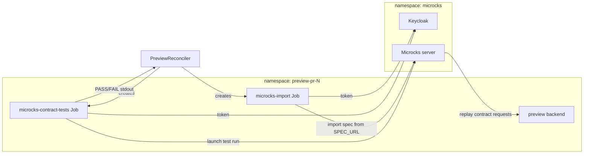
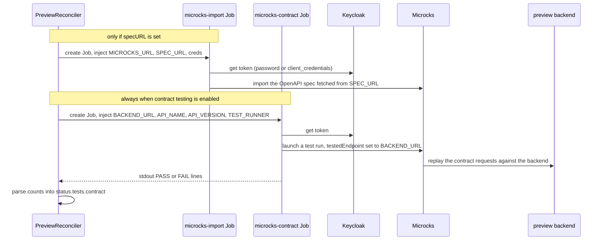

# Microcks — Contract Testing (deep dive)

> How the operator verifies that a preview's running backend honours its OpenAPI contract, using Microcks — the install, the two Jobs, the Keycloak auth, and the protocol.

## Introduction
[Microcks](https://microcks.io) is an API mocking and **contract testing** server.
This operator uses it to answer one question for every preview: *does the deployed
backend still conform to its OpenAPI specification?* It does this without you
hand‑writing endpoint tests — Microcks replays the contract against the live
preview backend and reports conformance. This guide is the end‑to‑end map:
installation, the two Kubernetes Jobs the operator runs, how they authenticate to
Microcks through Keycloak, and what the app‑side scripts must do.

> Contract testing is one of the test suites. For the suite pipeline as a whole see
> [Test Suites](./test-suites.md); to ship the scripts see [Authoring Tests](./authoring-tests.md).

## The big picture



The operator runs everything as short‑lived Jobs **inside the preview namespace**,
using the **app's own image** (the scripts ship in the image). Microcks and its
bundled Keycloak live in a separate `microcks` namespace, shared by all previews.
The operator never calls Microcks itself — it injects environment variables and
parses `PASS`/`FAIL` lines from the Jobs' logs.

## Installation
Microcks (with Keycloak) is installed once per cluster, in the `microcks` namespace:

```bash
helm install microcks microcks/microcks \
  --namespace microcks --create-namespace \
  --set "microcks.url=microcks.${NODE_IP}.nip.io" \
  --set "microcks.ingressClassName=nginx" --set "microcks.generateCert=false" \
  --set "keycloak.url=keycloak.${NODE_IP}.nip.io" \
  --set "keycloak.ingressClassName=nginx" --set "keycloak.generateCert=false"
```

In‑cluster, the operator's defaults point at:
- Microcks: `http://microcks.microcks.svc.cluster.local:8080`
- Keycloak realm: `http://microcks-keycloak.microcks.svc.cluster.local:8080/realms/microcks`
- Default manager credentials: `manager` / `microcks123` (demo values — change them for anything real).

## Configuration — `spec.testSuite.contractTesting`
| Field | Type | Default | Purpose |
|-------|------|---------|---------|
| `enabled` | bool | `false` | Master switch for contract testing |
| `microcksURL` | string | **required** | In‑cluster Microcks base URL |
| `specURL` | string | — | OpenAPI spec to import first; **if set, the import Job runs** |
| `apiName` | string | `"Preview Catalog API"` | API name as registered in Microcks |
| `apiVersion` | string | `"1.0.0"` | API version in Microcks |
| `testRunner` | string | `"OPEN_API_SCHEMA"` | Runner type: `OPEN_API_SCHEMA` \| `POSTMAN` \| `HTTP` |
| `timeoutSeconds` | int32 | `60` | Test wait; injected as `TEST_TIMEOUT_MS` (×1000) |
| `importUsername` | string | `"manager"` | Keycloak user for the import (password grant) |
| `importPassword` | string | `"microcks123"` | Keycloak password for the import |
| `credentialsSecretName` | string | — | Secret (preview ns) with keys `client_id` / `client_secret` for OAuth2 |
| `keycloakURL` | string | realm default (import) | Keycloak token endpoint |

```yaml
spec:
  testSuite:
    enabled: true
    contractTesting:
      enabled: true
      microcksURL: http://microcks.microcks.svc.cluster.local:8080
      specURL: https://raw.githubusercontent.com/acme/app/main/api/openapi.yaml
      apiName: "Acme Catalog API"
      apiVersion: "1.0.0"
      testRunner: OPEN_API_SCHEMA
      timeoutSeconds: 120
```

## The two Jobs
Both run the **app image** (`python /app/tests/microcks*.py`), `backoffLimit: 0`,
`RestartPolicy: Never`, and are auto‑cleaned by TTL.

### 1. `microcks-import` — load the spec into Microcks
Runs **only when `specURL` is set**. TTL 300s. Injected env:

| Var | Source | Notes |
|-----|--------|-------|
| `MICROCKS_URL` | `microcksURL` | required |
| `SPEC_URL` | `specURL` | the OpenAPI doc to fetch + import |
| `MICROCKS_KEYCLOAK_URL` | `keycloakURL` or realm default | **always set** (default applied here) |
| `MICROCKS_USERNAME` | `importUsername` (`manager`) | **always set** |
| `MICROCKS_PASSWORD` | `importPassword` (`microcks123`) | **always set** |
| `MICROCKS_CLIENT_ID` / `MICROCKS_CLIENT_SECRET` | `credentialsSecretName` keys | only if that Secret is set |

> **Import is non‑blocking.** If it fails, the pipeline continues — the contract
> test simply finds no spec and returns zero results.

### 2. `microcks-contract-tests` — run the contract test
Runs whenever contract testing is enabled and the suite is selected. TTL 600s. Injected env:

| Var | Source | Notes |
|-----|--------|-------|
| `MICROCKS_URL` | `microcksURL` | required |
| `BACKEND_URL` | computed | in‑cluster FQDN of the preview backend (the system under test) |
| `API_NAME` | `apiName` (`Preview Catalog API`) | identifies the service in Microcks |
| `API_VERSION` | `apiVersion` (`1.0.0`) | |
| `TEST_RUNNER` | `testRunner` (`OPEN_API_SCHEMA`) | |
| `TEST_TIMEOUT_MS` | `timeoutSeconds`×1000 (`60000`) | milliseconds |
| `MICROCKS_KEYCLOAK_URL` | `keycloakURL` | only if set (no default here) |
| `MICROCKS_CLIENT_ID` / `MICROCKS_CLIENT_SECRET` | `credentialsSecretName` keys | only if that Secret is set |

> **Contract failure is non‑blocking too** — a failed contract run does not stop
> regression or E2E; results are recorded and the pipeline continues.

## Where it runs in the pipeline
Contract testing slots in **after smoke** (and after migration, if present), before
regression:

```
smoke → [migration] → import-spec → contract → [restore] → regression → [restore] → e2e
```

The controller polls the import Job every 5s and the contract Job every 10s, then
advances regardless of their outcome (both non‑blocking).

## Authentication — Keycloak, two paths
The operator hands credentials to the scripts via env vars; the **scripts** perform
the actual Keycloak token exchange and Microcks calls.

- **Password grant (default).** The import Job always receives `MICROCKS_USERNAME` /
  `MICROCKS_PASSWORD` (`manager` / `microcks123`) and the realm URL — the script
  fetches a token with the Keycloak *password* grant.
- **Client credentials (optional).** Set `credentialsSecretName` (a Secret in the
  preview namespace with `client_id` / `client_secret`); both Jobs then receive
  `MICROCKS_CLIENT_ID` / `MICROCKS_CLIENT_SECRET` and the script uses the OAuth2
  *client_credentials* grant instead.

## The protocol — what the scripts do



In words: the import script gets a Keycloak token, fetches the OpenAPI doc from
`SPEC_URL`, and uploads it to Microcks (idempotent). The contract script gets a
token and asks Microcks to run a test of `API_NAME` / `API_VERSION` using
`TEST_RUNNER`, pointing the runner at `BACKEND_URL` — so **Microcks**, not the
script, issues the contract requests at the live backend. The script polls until
the run completes (bounded by `TEST_TIMEOUT_MS`) and prints one `PASS`/`FAIL` line
per checked operation.

> **The exact Microcks REST calls live in the app's scripts, not in this operator.**
> The operator's contract is purely the environment variables above plus the
> `PASS`/`FAIL` stdout convention — see [Authoring Tests](./authoring-tests.md).

## Results
The controller reads the contract Job's logs, counts `PASS ` / `FAIL ` lines, and
records `status.tests.contract` (`phase`, `passed`, `failed`, `output`). The
[GitHub Integration](./github-integration.md) renders a row in the PR results table:

```
| 📋 Contract (Microcks) | ✅ Succeeded | 12 | 0 |
```

`phase` is `Succeeded` when the Job exits 0, `Failed` on a non‑zero exit, `Skipped`
when not selected.

## Authoring the scripts
The operator does **not** ship `microcks-import.py` / `microcks.py` — you bake them
into your app image at the fixed paths `/app/tests/microcks-import.py` and
`/app/tests/microcks.py` (these paths are not overridable). Each script just needs
to read the env vars above, talk to Keycloak + Microcks, and print `PASS`/`FAIL`
lines. Full contract: [Authoring Tests](./authoring-tests.md).

## Gotchas
- **Scripts must be in the app image** at the two fixed paths; unlike smoke/regression/e2e, the Microcks Jobs' command and image are **not** overridable via spec or the `preview-test-scripts` ConfigMap.
- **`manager` / `microcks123` are demo defaults.** Override `importUsername`/`importPassword` (or use `credentialsSecretName`) for any non‑throwaway Microcks.
- **`specURL` decides whether the import Job runs.** No `specURL` ⇒ no import ⇒ the contract run depends on the spec already existing in Microcks under `apiName`/`apiVersion`.
- **Both Jobs are non‑blocking** — a Microcks outage or a failed contract never blocks the rest of the suite; watch the `📋 Contract` row to notice failures.
- **`keycloakURL` default applies to the import Job only.** The contract Job receives it only if you set it explicitly.

## Relationships with other components
- [Test Suites](./test-suites.md) — the pipeline contract testing runs within.
- [Authoring Tests](./authoring-tests.md) — how to write and ship the two scripts.
- [AI Test Strategist](./ai-test-strategist.md) — decides whether the `contract` suite is selected for a given diff.
- [GitHub Integration](./github-integration.md) — renders the contract results row.
- [Change Context](./change-context.md) — `apiContract` / `openapi.yaml` signals that make the strategist pick contract testing.

## Reference
- Jobs, env injection, parsing: [`../../internal/controller/tests.go`](https://github.com/ihsenalaya/preview-operator/blob/main/internal/controller/tests.go) (`microcksImportJob`, `microcksContractTestJob`, `contractTestEnabled`, the suite pipeline)
- Spec: [`../../api/v1alpha1/preview_types.go`](https://github.com/ihsenalaya/preview-operator/blob/main/api/v1alpha1/preview_types.go) — `ContractTestingSpec`
- PR comment row: [`../../internal/controller/github.go`](https://github.com/ihsenalaya/preview-operator/blob/main/internal/controller/github.go)
- Samples: [`../../config/samples/fullsuite_preview.yaml`](https://github.com/ihsenalaya/preview-operator/blob/main/config/samples/fullsuite_preview.yaml), [`../../config/samples/auto_preview.yaml`](https://github.com/ihsenalaya/preview-operator/blob/main/config/samples/auto_preview.yaml)
- Install: [`../../README.md`](https://github.com/ihsenalaya/preview-operator/blob/main/README.md) (Installation → Microcks)
