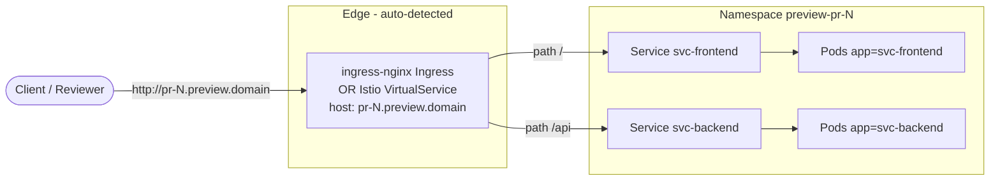

# Networking & Exposure

> How each Preview gets a stable, reachable public URL by wiring per-app Services to an auto-detected Ingress or Istio VirtualService.

## Introduction
Every Preview environment runs in its own namespace and must be reachable at a predictable URL so reviewers, CI, and test jobs can hit it. The operator provisions a ClusterIP Service for each app, then exposes it through either an ingress-nginx `Ingress` or an Istio `VirtualService` — whichever it detects in the cluster at startup. The resulting URL is published on `status.url` and follows the pattern `http://pr-<N>.preview.<domain>`.

## What it's for
A Preview is useless if nobody can open it. This feature turns an internal Deployment into a routable HTTP endpoint without per-PR DNS or manual ingress edits, and supports multi-service stacks (e.g. frontend + backend) behind a single hostname using path prefixes.

## What it does
- Creates a ClusterIP `Service` per app: `app` (single-service) or `svc-<name>` (multi-service).
- Auto-detects the routing layer once at startup (`IstioEnabled`) by probing for the Istio `VirtualService` CRD via the REST mapper.
- Builds the public host `pr-<prNumber>.<PreviewDomain>` (default domain `preview.localtest.me`) and the URL `http://<host>`.
- Reconciles exactly one routing object named `app`: an `Ingress` (class `nginx`) or an Istio `VirtualService` bound to gateway `istio-system/preview-gateway`.
- Routes multi-service traffic by `pathPrefix`; services without a `pathPrefix` are deployed but not publicly exposed.
- Publishes the URL on `status.url` once the environment reaches `Running` (consumed by the GitHub integration and test jobs).
- Deletes the routing object when the Preview is removed.

## How it works



Walkthrough: on each reconcile the controller calls `reconcileService` (Services) then `reconcileExposure`. `reconcileExposure` dispatches on `IstioEnabled`: Istio takes the `reconcileVirtualService` path, otherwise `reconcileIngress`. In single-service mode the routing object forwards all traffic to backend host `app`; in multi-service mode it iterates `spec.services`, emitting one path rule per service that declares a `pathPrefix` (defaulting the backend port to `8080` when `port` is unset). The host is always `previewHost()` = `pr-<prNumber>.<domain>`. nginx single-service ingress adds the `nginx.ingress.kubernetes.io/rewrite-target: /` annotation.

## Relationships with other components
- [Security](./security.md) — owns the per-namespace `preview-isolation` NetworkPolicy. Ingress is denied by default and only allowed from the `ingress-nginx` and `istio-system` namespaces (plus intra-namespace), so this exposure layer only works because Security explicitly admits the edge. PSS labels are also applied there.
- [Lifecycle & Provisioning](./lifecycle.md) — creates the namespace and Deployments, runs `reconcileExposure`, then sets `status.url` and phase `Running` via `markRunningStatus`.
- [Test Suites](./test-suites.md) — regression and E2E jobs read `status.url` (`PREVIEW_URL`) to drive the live environment.

## Configuration

| Field | Type | Where | Effect |
|-------|------|-------|--------|
| `spec.prNumber` | int | spec | Forms the host `pr-<N>.preview.<domain>`. |
| `spec.services[].name` | string | spec | Service/Deployment named `svc-<name>`. |
| `spec.services[].port` | int32 | spec | Backend port (default `80` in schema; routing falls back to `8080` when `0`). |
| `spec.services[].pathPrefix` | string | spec | URL path routed to this service (e.g. `/`, `/api`). Empty = deployed but not exposed. |
| `status.url` | string | status | Public URL `http://pr-<N>.preview.<domain>`, set at `Running`. |
| `previewDomain` | flag/Helm | operator | Base domain (`PreviewDomain`); defaults to `preview.localtest.me`. |
| Istio vs nginx | auto | operator | `IstioEnabled` auto-detected at startup; not a CR field. |

Minimal multi-service example with `pathPrefix`:

```yaml
apiVersion: platform.ihsenalaya.xyz/v1alpha1
kind: Preview
metadata:
  name: pr-42
spec:
  branch: feature/checkout
  prNumber: 42
  image: ghcr.io/org/app:pr-42   # ignored when services[] is set
  services:
    - name: frontend
      image: ghcr.io/org/frontend:pr-42
      port: 8080
      pathPrefix: /        # served at pr-42.preview.<domain>/
    - name: backend
      image: ghcr.io/org/backend:pr-42
      port: 8080
      pathPrefix: /api     # served at pr-42.preview.<domain>/api
# status.url -> http://pr-42.preview.<domain>
```

## Reference
- Source: [`internal/controller/exposure.go`](https://github.com/ihsenalaya/preview-operator/blob/main/internal/controller/exposure.go) — Service routing object construction, host/URL helpers, Istio vs nginx dispatch.
- Source: [`api/v1alpha1/preview_types.go`](https://github.com/ihsenalaya/preview-operator/blob/main/api/v1alpha1/preview_types.go) — `ServiceSpec` (`name`, `port`, `pathPrefix`), `PreviewSpec.Services`, `PreviewStatus.URL`.
- Source: [`internal/controller/preview_controller.go`](https://github.com/ihsenalaya/preview-operator/blob/main/internal/controller/preview_controller.go) — `reconcileService`, `reconcileMultiServices`, `markRunningStatus`, startup `IstioEnabled` detection.
- Related: [Security](./security.md), [Lifecycle & Provisioning](./lifecycle.md), [Test Suites](./test-suites.md).
