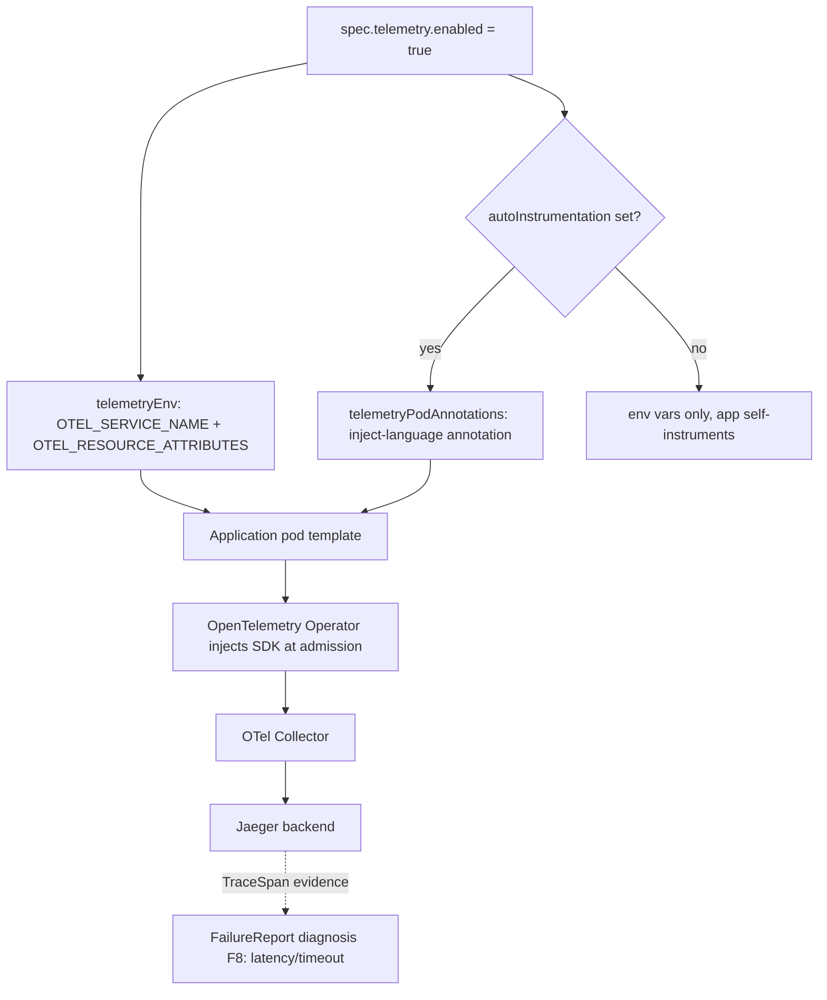

# Observability

> Opt preview workloads into zero-code OpenTelemetry auto-instrumentation by setting `spec.telemetry.enabled`, so traces flow to a collector and Jaeger without touching the application image.

## Introduction

The operator wires application observability into preview environments declaratively. When telemetry is enabled, the controller stamps every application pod template with OpenTelemetry environment variables and, optionally, the pod annotations the OpenTelemetry Operator recognizes for auto-instrumentation. The application image stays unchanged: instrumentation is injected at admission time by the OTel Operator, and emitted spans ship to a collector and on to Jaeger for visualization.

## What it's for

Preview environments are short-lived and reproduce production-like behavior for a single pull request. When a request is slow or a backend handler times out, raw pod logs rarely explain *why*. Distributed traces make latency visible per service and per span, and tagging each trace with the PR number, branch, and namespace lets a developer find the exact preview's traces in Jaeger. This feature removes the friction of manually adding an SDK to every preview build.

## What it does

- Injects `OTEL_SERVICE_NAME` and `OTEL_RESOURCE_ATTRIBUTES` env vars into the application container whenever `spec.telemetry.enabled` is `true`.
- Tags every trace with preview provenance: `preview.name`, `preview.pr_number`, `preview.branch`, and `k8s.namespace.name` (values sanitized for OTel).
- Defaults `OTEL_SERVICE_NAME` to `preview-<resource-name>` when `serviceName` is unset.
- When `spec.telemetry.autoInstrumentation` is set, adds the `instrumentation.opentelemetry.io/inject-<language>` pod annotation so the OpenTelemetry Operator injects the SDK (sidecar or init container, per language).
- Adds language-specific annotations: `otel-python-platform` (for `pythonPlatform`) and `otel-go-auto-target-exe` (for `goTargetExecutable`).
- Applies the same env vars and annotations to both the single-image Deployment and every per-service Deployment in a multi-service preview.

## How it works



The controller's `telemetryEnv` builds the env vars from the `Preview` spec and namespace, and `telemetryPodAnnotations` builds the inject annotation (defaulting `instrumentationRef` to `"true"` when empty). Both are stamped onto the pod template during `reconcileDeployment` / `reconcileServiceDeployments`. The OpenTelemetry Operator — installed separately — watches for the inject annotation and mutates matching pods to add the language SDK. Spans then flow to the collector and into Jaeger, where they are filtered by the `OTEL_SERVICE_NAME` value.

For failure diagnosis, `TraceSpan` is one of the typed evidence kinds in the `FailureReport` model, and the F8 rule (`ruleLatencyTimeout`) raises an `observability`-category diagnosis when a slow/long-duration trace span coincides with a timeout log. Note: the *deterministic* evidence collectors gather diff, status, events, logs, and test results from the `Preview` object — they do not pull spans back from Jaeger, so within the `FailureReport` pipeline `TraceSpan` is a supported vocabulary and rule input rather than an automatically populated source.

Traces **are** consumed live elsewhere, though: the kagent [AI Failure Analysis](./ai-failure-analysis.md) agent queries Jaeger directly through the `jaeger-mcp-server` MCP tools (`jaeger_get_services` / `jaeger_get_traces` / `jaeger_get_trace`) to find failing requests when it diagnoses a failed preview. So this instrumentation is what makes that trace-aware analysis possible.

## Relationships with other components

- [Failure Provenance](./failure-provenance.md) — consumes `TraceSpan` evidence (F8 latency/timeout rule) to diagnose slow-handler failures.
- [AI Failure Analysis](./ai-failure-analysis.md) — the kagent troubleshooter reads these Jaeger traces live via [`jaeger-mcp-server`](./mcp-servers.md).
- [Lifecycle & Provisioning](./lifecycle.md) — telemetry wiring is applied during Deployment reconciliation, before the preview reaches `Running`.

## Configuration

| Field | Type | Default | Notes |
|---|---|---|---|
| `spec.telemetry.enabled` | bool | `false` | Master switch; when true, env vars are injected. |
| `spec.telemetry.serviceName` | string | `preview-<name>` | Sets `OTEL_SERVICE_NAME`. |
| `spec.telemetry.autoInstrumentation.language` | enum | (required when set) | `python` \| `java` \| `nodejs` \| `dotnet` \| `go` \| `sdk`. |
| `spec.telemetry.autoInstrumentation.instrumentationRef` | string | `"true"` | `Instrumentation` CR: `"true"`, `name`, or `namespace/name`. |
| `spec.telemetry.autoInstrumentation.pythonPlatform` | enum | unset | `glibc` \| `musl`; use `musl` for Alpine Python images. |
| `spec.telemetry.autoInstrumentation.goTargetExecutable` | string | unset | Required for Go; path to the executable in the container. |

Minimal example:

```yaml
apiVersion: platform.company.io/v1alpha1
kind: Preview
metadata:
  name: pr-42
spec:
  branch: feat/my-feature
  prNumber: 42
  image: ghcr.io/org/app:pr-42
  telemetry:
    enabled: true
    serviceName: myapp-pr-42
    autoInstrumentation:
      language: python
      instrumentationRef: observability/python   # namespace/name of the Instrumentation CR
      # pythonPlatform: musl       # Alpine-based Python images
      # goTargetExecutable: /app/myservice   # required when language: go
```

If `autoInstrumentation` is omitted while `enabled: true`, only the OTel env vars are injected and the application is expected to self-instrument.

## Reference

- Spec types: [`api/v1alpha1/preview_types.go`](https://github.com/ihsenalaya/preview-operator/blob/main/api/v1alpha1/preview_types.go) — `TelemetrySpec`, `AutoInstrumentationSpec`, `TelemetryLanguage`.
- Injection logic: [`internal/controller/preview_controller.go`](https://github.com/ihsenalaya/preview-operator/blob/main/internal/controller/preview_controller.go) — `telemetryEnv`, `telemetryPodAnnotations`, `sanitizeOTelResourceValue`.
- Evidence vocabulary: [`api/v1alpha1/failurereport_types.go`](https://github.com/ihsenalaya/preview-operator/blob/main/api/v1alpha1/failurereport_types.go) — `EvidenceTypeTraceSpan`.
- Diagnosis rule: [`internal/diagnosis/rules.go`](https://github.com/ihsenalaya/preview-operator/blob/main/internal/diagnosis/rules.go) — `ruleLatencyTimeout` (F8).
- README: [`../../README.md`](https://github.com/ihsenalaya/preview-operator/blob/main/README.md) — Installation Step 4 (OpenTelemetry Operator) and Step 5 (Jaeger).
