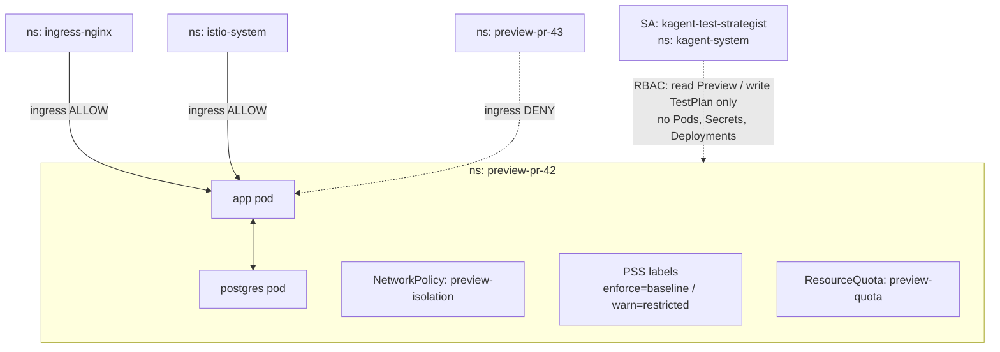

# Security & Isolation

> Every preview namespace is hardened on creation with a default-deny NetworkPolicy, Pod Security Standards labels, and a ResourceQuota — and the AI test-strategist runs under a deliberately tiny RBAC footprint.

## Introduction
Preview environments are ephemeral, untrusted, and densely packed: dozens of per-PR namespaces share one cluster. The operator treats each one as a hostile tenant, applying network, pod-security, and resource controls automatically before any workload is scheduled. None of these controls is opt-in — they are always on.

## What it's for
Multi-tenant isolation and bounded blast radius. A compromised pod in `preview-pr-42` must not reach `preview-pr-43`, production, or the cluster control plane. A compromised AI agent must not be able to mutate workloads or read secrets. The architecture enforces these properties through Kubernetes primitives — RBAC, NetworkPolicy, PSS — rather than trusting code to behave.

## What it does
- **NetworkPolicy `preview-isolation`** (per namespace, `PolicyTypes: Ingress, Egress`): allows ingress only from pods in the same namespace, from namespace `ingress-nginx`, and from namespace `istio-system`; denies all other cross-namespace ingress; allows all egress (DB, AI API, GitHub API, registry, DNS).
- **Pod Security Standards labels** on the namespace: `pod-security.kubernetes.io/enforce: baseline` and `pod-security.kubernetes.io/warn: restricted`.
- **ResourceQuota `preview-quota`** (per namespace): hard caps on `limits.cpu`, `limits.memory`, `requests.cpu`, `requests.memory`, and `pods: 10`, scaled by tier and enabled add-ons (Postgres, AI enrichment, test suite).
- **Bounded-blast-radius RBAC** for the agent ServiceAccount `kagent-test-strategist` (namespace `kagent-system`): read-only on previews/testplans/reconcileevents, write only on testplans; no access to Deployments, Pods, Secrets, ConfigMaps, Jobs, or Namespaces.

## How it works

Provisioning applies these controls early in the reconcile loop. `reconcileNamespace()` creates the namespace stamped with the PSS labels; `reconcileResourceQuota()` and `reconcileNetworkPolicy()` then create `preview-quota` and `preview-isolation`. If any of these fails the reconcile returns an error (e.g. status reason `NetworkPolicyFailed`) and retries — no workload is created without the guardrails in place. The agent never participates in this loop: it only ever writes a declarative `TestPlan`, which the controller validates before acting, so a compromised agent's worst case is forcing a full test suite.

## Relationships with other components
- [Networking & Exposure](./networking-exposure.md) — the NetworkPolicy deliberately whitelists the `ingress-nginx` and `istio-system` namespaces that front preview URLs.
- [AI Test Strategist](./ai-test-strategist.md) — the component running under the bounded `kagent-test-strategist` ServiceAccount.
- [Lifecycle & Provisioning](./lifecycle.md) — where namespace, quota, and policy are created during reconciliation.
- [RBAC Design — Bounded Blast Radius](https://github.com/ihsenalaya/preview-operator/blob/main/docs/rbac-design.md) — the full agent permission deep-dive.
- [SECURITY.md](https://github.com/ihsenalaya/preview-operator/blob/main/SECURITY.md) — the project threat model, RBAC table, and known limitations.

## Configuration
All controls are always-on; there is no opt-in flag. Values below are fixed in code/manifests.

| Control | Object | Key value(s) | Source |
|---|---|---|---|
| Default-deny ingress | NetworkPolicy `preview-isolation` | Allowed ingress: same-namespace pods, ns `ingress-nginx`, ns `istio-system`; egress: all | `reconcileNetworkPolicy()` |
| Pod Security Standards | Namespace labels | `pod-security.kubernetes.io/enforce: baseline`, `pod-security.kubernetes.io/warn: restricted` | `reconcileNamespace()` |
| Resource caps | ResourceQuota `preview-quota` | `limits.cpu`, `limits.memory`, `requests.cpu`, `requests.memory`, `pods: 10` | `reconcileResourceQuota()` |
| Agent permissions | ClusterRole `kagent-test-strategist` | `get/list/watch` on previews, testplans, reconcileevents; `create/update/patch` on testplans, testplans/status | `config/rbac/agent_role.yaml` |

**Agent ServiceAccount:** `kagent-test-strategist` in namespace `kagent-system`, bound cluster-wide via the `kagent-test-strategist` ClusterRoleBinding. It has **no** access to Deployments, Jobs, Pods, Secrets, ConfigMaps, or Namespaces, and **no** write access to TestRuns or ReconcileEvents (controller-only).

The controller itself runs as ServiceAccount `controller-manager` (namespace `system`), bound to the `manager-role` ClusterRole, which holds the full reconcile permissions the agent lacks.

## Reference
- NetworkPolicy, PSS labels, ResourceQuota: [`internal/controller/preview_controller.go`](https://github.com/ihsenalaya/preview-operator/blob/main/internal/controller/preview_controller.go) (`reconcileNamespace`, `reconcileResourceQuota`, `reconcileNetworkPolicy`)
- Exposure / ingress whitelisted by the policy: [`internal/controller/exposure.go`](https://github.com/ihsenalaya/preview-operator/blob/main/internal/controller/exposure.go)
- Agent RBAC: [`config/rbac/agent_role.yaml`](https://github.com/ihsenalaya/preview-operator/blob/main/config/rbac/agent_role.yaml), [`config/rbac/agent_rolebinding.yaml`](https://github.com/ihsenalaya/preview-operator/blob/main/config/rbac/agent_rolebinding.yaml), [`config/rbac/service_account.yaml`](https://github.com/ihsenalaya/preview-operator/blob/main/config/rbac/service_account.yaml)
- Controller RBAC: [`config/rbac/role.yaml`](https://github.com/ihsenalaya/preview-operator/blob/main/config/rbac/role.yaml)
- [RBAC Design — Bounded Blast Radius](https://github.com/ihsenalaya/preview-operator/blob/main/docs/rbac-design.md)
- [SECURITY.md](https://github.com/ihsenalaya/preview-operator/blob/main/SECURITY.md)
