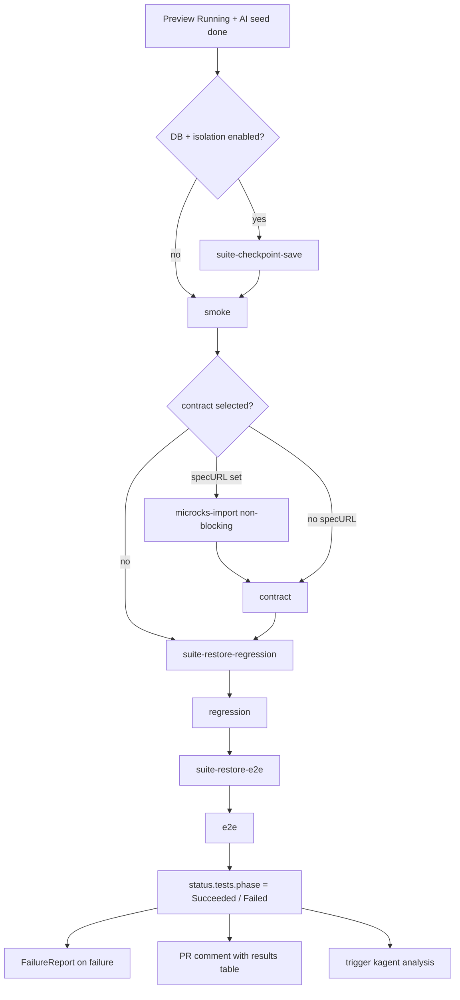

# Test Suites

> The four test types — smoke, OpenAPI contract (Microcks), regression, and E2E (Playwright) — the operator runs as sequential Jobs against a ready, seeded preview.

## Introduction
Once a preview environment is `Running` (and AI enrichment has seeded a realistic database), the operator runs a fixed pipeline of test Jobs against it. Each suite is a separate Kubernetes `Job`; the controller drives them one at a time through `status.tests.step`, parses `PASS`/`FAIL` lines from job stdout, and records per-suite outcomes in `status.tests`. This guide documents the suites themselves and how they execute. The decision of *which* suites to run for a given diff is made elsewhere — see [AI Test Strategist](./ai-test-strategist.md).

## What it's for
Per-PR previews need verification that matches the change: a health check, that the live API still satisfies its OpenAPI contract, that existing endpoints still behave, and that the real user flow works in a browser. Running these against an ephemeral, isolated environment (rather than shared staging) removes cross-PR pollution and gives every suite an identical, seeded starting state via [database checkpoints](./database-checkpoints.md).

## What it does
- **Smoke** (`spec.testSuite.smoke`, default on) — runs `python /app/tests/smoke.py` from the app image, with `APP_URL` injected; a fast health-endpoint check.
- **Contract** (`spec.testSuite.contractTesting.enabled`, default off) — runs `python /app/tests/microcks.py`, which drives a Microcks `OPEN_API_SCHEMA` test run against the live backend to validate the OpenAPI contract.
- **Spec import** (`spec.testSuite.contractTesting.specURL`) — optional pre-step `python /app/tests/microcks-import.py` that fetches the OpenAPI spec at runtime and uploads it to Microcks (non-blocking; failure just yields zero contract results).
- **Regression** (`spec.testSuite.regression`, default on) — runs `python /app/tests/regression.py` from the app image, with `APP_URL`, `FRONTEND_URL`, and `PREVIEW_URL` injected.
- **E2E** (`spec.testSuite.e2e`, default on) — copies `/app/tests` from the app image into an `emptyDir` via an init container, then runs `python /data/tests/e2e.py` in the Playwright/Chromium image (`mcr.microsoft.com/playwright/python:v1.44.0-jammy`).
- **Migration** (`spec.testSuite.migration`, default off) — optional Alembic-validation Job that runs after smoke when migration changes are detected.

## How it works



The controller stores the current stage in `status.tests.step` (`saving → smoke → import-spec → contract → restore-regression → regression → restore-e2e → e2e`) and creates exactly one Job per step via `checkOrCreateTestJob`. A suite that is disabled or not selected by the accepted `TestPlan` (`policy.IsSuiteSelected`) is marked `Skipped` and the pipeline advances. Contract and import failures are non-blocking — the pipeline continues regardless. When the database is enabled with isolation, a checkpoint is saved up front and restored before regression and before E2E so each suite starts from the same seeded state. Every Job has `ActiveDeadlineSeconds=300` so a hung suite is terminated and reported rather than blocking forever. When all selected suites reach a final state, the controller sets `status.tests.phase`, writes the `TestSuiteReady` condition, captures a `FailureReport` on any failure, posts the results comment to the PR, and (if enabled) triggers kagent.

## Relationships with other components
- [Authoring Tests](./authoring-tests.md) — **how to write and ship the test scripts this pipeline runs.**
- [Microcks — Contract Testing](./microcks-contract-testing.md) — deep dive on the contract suite (import/test Jobs, Keycloak auth, protocol).
- [AI Test Strategist](./ai-test-strategist.md) — decides which suites run via the `TestPlan` consumed here.
- [Database Checkpoints](./database-checkpoints.md) — the save/restore steps that isolate each suite.
- [GitHub Integration](./github-integration.md) — renders `status.tests` into the PR results comment.
- [Change Context](./change-context.md) — diff signals that feed suite selection and migration detection.

## Configuration

| Field | Default | Purpose |
|-------|---------|---------|
| `spec.testSuite.enabled` | `false` | Master switch for the whole pipeline. |
| `spec.testSuite.smoke.enabled` | `true` (when block omitted) | Run the smoke suite. |
| `spec.testSuite.smoke.image` / `.command` | app image / `python /app/tests/smoke.py` | Override smoke image/command. |
| `spec.testSuite.contractTesting.enabled` | `false` | Run Microcks contract tests. |
| `spec.testSuite.contractTesting.microcksURL` | required | In-cluster Microcks base URL. |
| `spec.testSuite.contractTesting.apiName` | `Preview Catalog API` | API name registered in Microcks. |
| `spec.testSuite.contractTesting.apiVersion` | `1.0.0` | API version in Microcks. |
| `spec.testSuite.contractTesting.testRunner` | `OPEN_API_SCHEMA` | Microcks runner (`OPEN_API_SCHEMA`/`POSTMAN`/`HTTP`). |
| `spec.testSuite.contractTesting.timeoutSeconds` | `60` | Max wait for the Microcks run. |
| `spec.testSuite.contractTesting.specURL` | — | OpenAPI spec to auto-import before the contract test. |
| `spec.testSuite.contractTesting.importUsername` / `.importPassword` | `manager` / `microcks123` | Keycloak password-grant credentials for import. |
| `spec.testSuite.contractTesting.keycloakURL` | derived Microcks Keycloak URL | Token endpoint for import/auth. |
| `spec.testSuite.contractTesting.credentialsSecretName` | — | Secret with `client_id`/`client_secret` for OAuth2. |
| `spec.testSuite.regression.enabled` | `true` (when block omitted) | Run the regression suite. |
| `spec.testSuite.e2e.enabled` | `true` (when block omitted) | Run the Playwright E2E suite. |
| `spec.testSuite.e2e.image` / `.command` | Playwright image / loaded `e2e.command` | Override E2E image/command. |
| `spec.testSuite.migration.enabled` | `false` | Run the Alembic migration-validation suite. |

Default commands and the E2E image are overridable cluster-wide via the `preview-test-scripts` ConfigMap in the operator namespace (keys `migration.command`, `regression.command`, `e2e.image`, `e2e.command`); when absent, built-in defaults apply. Test scripts themselves ship in the app image under `/app/tests/`.

```yaml
apiVersion: platform.company.io/v1alpha1
kind: Preview
metadata:
  name: pr-42
spec:
  branch: feat/catalog
  prNumber: 42
  image: ghcr.io/acme/catalog:pr-42
  database:
    enabled: true
  testSuite:
    enabled: true
    contractTesting:
      enabled: true
      microcksURL: http://microcks.microcks.svc.cluster.local:8080
      specURL: https://raw.githubusercontent.com/acme/catalog/feat/catalog/api/openapi.yaml
    regression:
      enabled: true
    e2e:
      enabled: true
```

## Reference
- Suite orchestration & Job builders: [`../../internal/controller/tests.go`](https://github.com/ihsenalaya/preview-operator/blob/main/internal/controller/tests.go)
- Loadable command/image defaults: [`../../internal/controller/test_scripts_loader.go`](https://github.com/ihsenalaya/preview-operator/blob/main/internal/controller/test_scripts_loader.go)
- Checkpoint save/restore steps: [`../../internal/controller/checkpoint.go`](https://github.com/ihsenalaya/preview-operator/blob/main/internal/controller/checkpoint.go)
- `TestSuiteSpec` and sub-specs: [`../../api/v1alpha1/preview_types.go`](https://github.com/ihsenalaya/preview-operator/blob/main/api/v1alpha1/preview_types.go)
- `TestRun` resource: [`../../api/v1alpha1/testrun_types.go`](https://github.com/ihsenalaya/preview-operator/blob/main/api/v1alpha1/testrun_types.go)
- Suite selection policy: [`../../internal/policy/testplan_policy.go`](https://github.com/ihsenalaya/preview-operator/blob/main/internal/policy/testplan_policy.go)
- Related docs: [AI Test Strategist](./ai-test-strategist.md) · [Database Checkpoints](./database-checkpoints.md) · [GitHub Integration](./github-integration.md) · [Change Context](./change-context.md)
